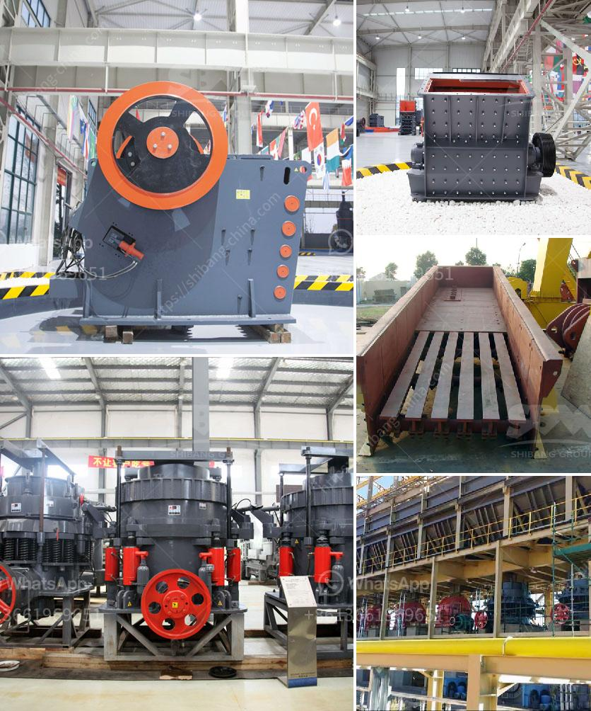

<h3>grinding mill machine in greece</h3>
Greece, a country known for its rich agricultural history, has embraced technology to enhance its farming practices. One such technological advancement that has revolutionized the agricultural sector is the grinding mill machine. This machine has proven to be a game-changer in processing various crops and maximizing agricultural productivity.

A grinding mill machine is a powerful tool that is used to grind various types of crops such as wheat, corn, rice, and barley into fine powder or flour. This finely ground flour is then used in various food items, such as bread, pasta, and pastries, providing essential nutrients to consumers.

The grinding mill machines available in Greece are designed with cutting-edge technology and precision engineering to deliver efficient and consistent grinding results. These machines are equipped with high-speed rotating blades and adjustable settings that allow farmers to achieve desired fineness levels.

One major advantage of using grinding mill machines in Greece is the preservation of nutritional value. Traditional grinding methods involving stone mills often result in nutrient loss due to excessive heat generated during the grinding process. In contrast, modern grinding mill machines utilize advanced cooling systems, preserving the nutritional content of crops and ensuring healthier food production.

Moreover, grinding mill machines offer a significant reduction in labor and time compared to manual grinding techniques. These machines are designed to handle large quantities of crops at once, enabling farmers to process more produce in less time. This increased efficiency not only leads to higher productivity but also provides ample time for farmers to focus on other essential aspects of their agricultural practices.

The grinding mill machines available in Greece are versatile and can handle various crops, making them an essential tool for farmers with diverse agricultural produce. Farmers can easily adjust the settings of these machines to accommodate different types of grains, allowing them to meet the specific demands of their consumers.

Additionally, grinding mill machines are equipped with safety features to protect both farmers and the machine itself. These safety features include emergency shut-off systems, anti-overload mechanisms, and guards to prevent accidental injuries. This ensures a secure working environment and promotes the well-being of farmers while operating the machine.

It is important to mention that grinding mill machines are also environmentally friendly. These machines are designed to be energy-efficient, minimizing power consumption. Furthermore, they produce less noise and vibration compared to traditional grinding methods, reducing overall pollution and impact on the environment.

In conclusion, grinding mill machines have revolutionized agricultural practices in Greece. Their efficiency, precision, and preservation of nutritional value have made them an indispensable tool for farmers. These machines not only save time and labor but also contribute to environmental sustainability. As Greece continues to embrace technological advancements in agriculture, grinding mill machines will play a crucial role in enhancing the overall agricultural productivity of the country.
<h3>Contact us</h3><ul><li><strong>Whatsapp:&nbsp;<a href="https://wa.me/8613661969651">+8613661969651</a></strong></li><li><a href="https://swt.shibang-china.com/?git&amp;zhl&amp;grinding mill machine in greece"><strong>Online Service(chat now)</strong></a></li></ul><h3>Related</h3><ul><li><a href='gypsum board manufacturing plant.md'>gypsum board manufacturing plant</a></li><li><a href='ball mill machinery manufacturer india.md'>ball mill machinery manufacturer india</a></li><li><a href='diamond mining equipment.md'>diamond mining equipment</a></li><li><a href='50 tpd cement plant manufacturer in china.md'>50 tpd cement plant manufacturer in china</a></li><li><a href='roll mill machine manufacturers.md'>roll mill machine manufacturers</a></li></ul>