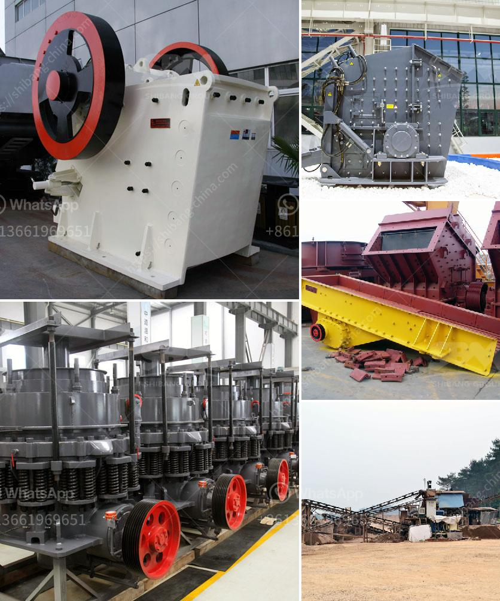

<h3>grinding mill of cerial in ethiopia</h3>
Grinding mills have become a crucial part of the cereal industry in Ethiopia. These mills, which are operated by hand or with the help of electricity, grind grains into flour. They play a significant role in ensuring that the cereal products consumed by Ethiopians are of high quality and meet the nutritional needs of the population.

In Ethiopia, cereals are a staple food. They form the basis of many traditional dishes, including injera, which is made from fermented teff flour. Teff is a gluten-free grain that is indigenous to Ethiopia and is packed with nutrients such as iron, calcium, and magnesium. To obtain flour from teff and other grains like barley, wheat, and maize, grinding mills are essential.

A grinding mill works by crushing grains between two stones or metal plates. The grains are spread evenly between the grinding surfaces, and as the stones or plates move, they grind the grains into flour. The process can be time-consuming if done manually, but it is crucial for delivering finely ground flour that is free from impurities.

With the advent of electricity in rural areas of Ethiopia, many grinding mills have been equipped with electric motors. This allows for faster and more efficient grinding, saving both time and effort. This is particularly beneficial for small-scale farmers who rely on grinding mills to process their harvested grains.

One challenge in the grinding mill industry in Ethiopia is the availability of spare parts. Due to the import-dependent nature of the industry, spare parts can be expensive and scarce. This can lead to downtime and affect the production capacity of grinding mills.

Nevertheless, grinding mills continue to play a crucial role in Ethiopia's cereal industry, ensuring that the population has access to high-quality flour. Local governments and organizations should prioritize investing in the construction and maintenance of grinding mills, as they are key to supporting the country's food security and nutrition goals.
<h3>Contact us</h3><ul><li><strong>Whatsapp:&nbsp;<a href="https://wa.me/8613661969651">+8613661969651</a></strong></li><li><a href="https://swt.shibang-china.com/?git&amp;zhl&amp;grinding mill of cerial in ethiopia"><strong>Online Service(chat now)</strong></a></li></ul><h3>Related</h3><ul><li><a href='crusher for sale peru.md'>crusher for sale peru</a></li><li><a href='ultra white silica processing.md'>ultra white silica processing</a></li><li><a href='ball mill equipment 150 ton hr.md'>ball mill equipment 150 ton hr</a></li><li><a href='primary crusher ball milling pengertian.md'>primary crusher ball milling pengertian</a></li><li><a href='crusher price for crushed stone.md'>crusher price for crushed stone</a></li></ul>