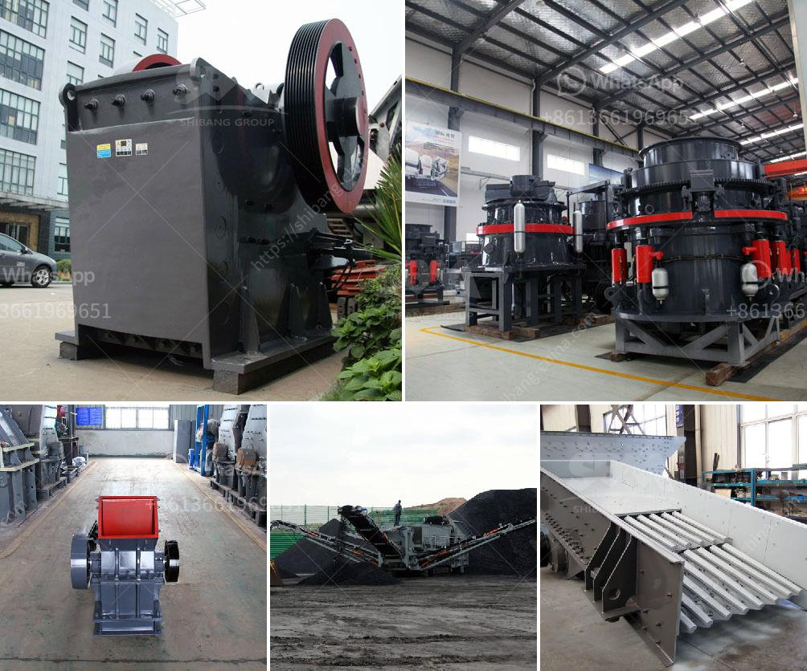

<h3>grinding mill prices in harare</h3>
The price of grinding mills in Harare has significantly increased over the past few years. This has forced many buyers to turn to alternative cheaper sources such as online suppliers and even smuggling. It is important to note that while buying grinding mills from Harare may seem cheaper, there are other factors to consider such as transportation costs and the time it takes for the products to reach the buyer.

The rise in grinding mill prices in Harare has been attributed to the scarcity of electricity, the depreciating value of the local currency, and the high production costs. With constant power cuts and fuel shortages, the cost of running grinding mills has skyrocketed. Additionally, the depreciation of the local currency makes it expensive to import spare parts and machinery used in the production of grinding mills.

The scarcity of grinding mills in Harare has also contributed to the rise in prices. Many suppliers are taking advantage of the high demand and limited supply to inflate the prices. This has left many buyers frustrated and struggling to find affordable grinding mills.

However, this does not mean that there are no bargains to be found in Harare. Savvy buyers who do their due diligence can still find grinding mill prices that are reasonable. They may have to shop around and compare prices from different suppliers before making a decision. Additionally, some suppliers may offer discounts or promotions, especially during festive seasons or when trying to clear out old stock.

It is also worth mentioning that grinding mill prices in Harare can vary depending on the type of mill and its specifications. Some mills are specifically designed for grinding specific types of grains or materials, which may affect their prices.

In conclusion, grinding mill prices in Harare have witnessed a significant increase due to factors such as electricity shortages, currency depreciation, and high production costs. However, with careful research and comparison, buyers can still find affordable grinding mills in Harare. It is important to consider factors such as transportation costs and the reputation of the supplier before making a purchase.
<h3>Contact us</h3><ul><li><strong>Whatsapp:&nbsp;<a href="https://wa.me/8613661969651">+8613661969651</a></strong></li><li><a href="https://swt.shibang-china.com/?git&amp;zhl&amp;grinding mill prices in harare"><strong>Online Service(chat now)</strong></a></li></ul><h3>Related</h3><ul><li><a href='proposal usaha stone crusher.md'>proposal usaha stone crusher</a></li><li><a href='vertical cement grinding mill from 10 20 tph.md'>vertical cement grinding mill from 10 20 tph</a></li><li><a href='impact crusher discount.md'>impact crusher discount</a></li><li><a href='coal and iron ore mining business plan pdf.md'>coal and iron ore mining business plan pdf</a></li><li><a href='vertical mill coal.md'>vertical mill coal</a></li></ul>