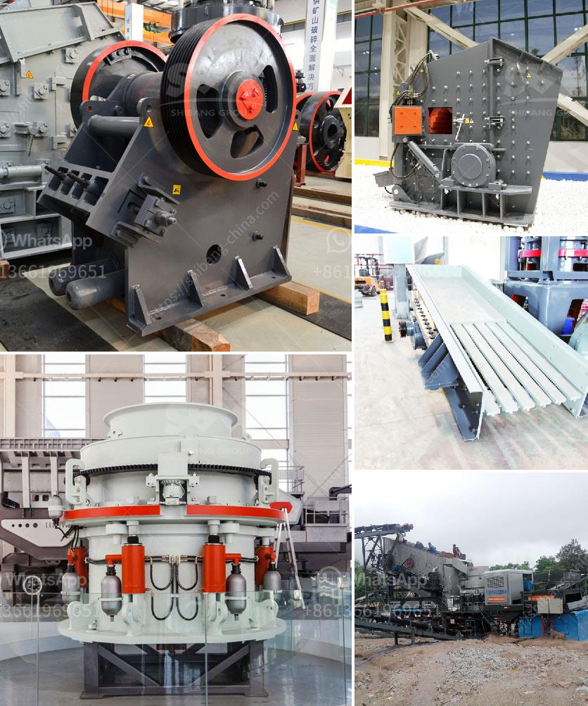

<h3>grinding mill sale</h3>
When it comes to purchasing a grinding mill, finding the best deal is crucial. A grinding mill is an essential tool in various industries such as mining, construction, and agriculture. It is used to grind and crush materials into smaller particles, allowing for easier processing and utilization. However, buying a high-quality grinding mill can be a significant investment. That’s why finding a grinding mill sale can be an excellent opportunity to save money without compromising on quality.

A grinding mill sale usually offers discounted prices, making it an ideal time to make your purchase. Whether you are looking for a ball mill, hammer mill, or any other type of grinding mill, these sales can give you access to an extensive range of options at competitive prices. By taking advantage of a grinding mill sale, you can find the perfect mill that meets your requirements without breaking the bank.

Furthermore, a grinding mill sale may also include promotions or special offers that enhance the value of your purchase. These could range from free shipping to additional accessories or even extended warranties. Manufacturers and suppliers often use sales as an opportunity to attract more customers and build long-term relationships. As a buyer, you can take advantage of these offers to maximize the benefits of your grinding mill purchase.

To make the most out of a grinding mill sale, it is crucial to do your research beforehand. Understand your specific requirements and the type of mill that would be most suitable for your needs. Compare prices, read reviews, and explore different suppliers to ensure you are getting the best value for your money. Additionally, consider the after-sales service offered by the supplier, such as technical support and spare parts availability.

In conclusion, a grinding mill sale provides an excellent opportunity to invest in a high-quality mill at a reduced cost. By taking advantage of discounted prices and special offers, you can save money without compromising on the quality or functionality of your grinding mill. Remember to research and compare options before making your purchase to ensure you are getting the best deal possible. So, keep an eye out for grinding mill sales and take your industrial operations to the next level!
<h3>Contact us</h3><ul><li><strong>Whatsapp:&nbsp;<a href="https://wa.me/8613661969651">+8613661969651</a></strong></li><li><a href="https://swt.shibang-china.com/?git&amp;zhl&amp;grinding mill sale"><strong>Online Service(chat now)</strong></a></li></ul><h3>Related</h3><ul><li><a href='the price of stone crusher.md'>the price of stone crusher</a></li><li><a href='ball mill for grinding of soda feldspar.md'>ball mill for grinding of soda feldspar</a></li><li><a href='chalcopyrite ore processing plant cost to built and sale.md'>chalcopyrite ore processing plant cost to built and sale</a></li><li><a href='brick stone crusher machine.md'>brick stone crusher machine</a></li><li><a href='mobile crushers for hire in product.md'>mobile crushers for hire in product</a></li></ul>