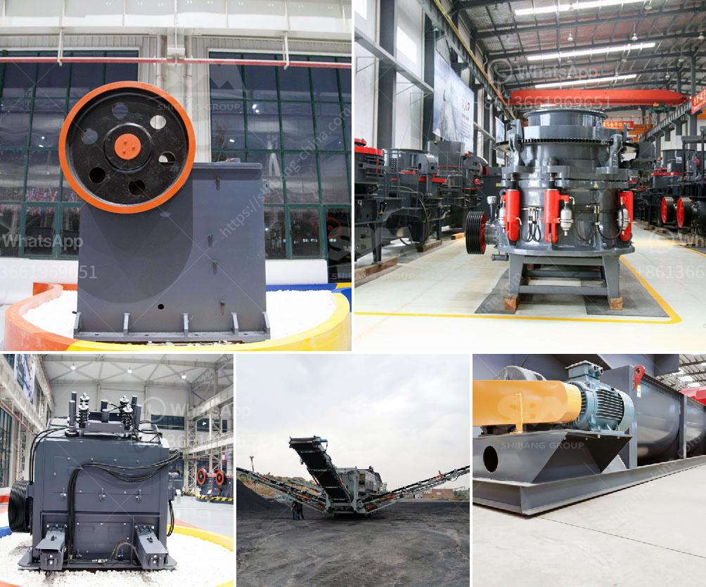

<h3>grinding mills for sale philippines</h3>
When it comes to agricultural machinery, grinding mills are among the most essential pieces of equipment. However, these machines can also be used for industrial purposes, such as for grinding large quantities of raw materials. Grinding mills come in various sizes, shapes, and capacities, making them suitable for a wide range of applications. In the Philippines, grinding mills are commonly used by farmers and commercial businesses alike. The availability of grinding mills for sale in the Philippines provides customers with various options to choose from, allowing them to find the most suitable grinding mill that meets their needs.

There are two main types of grinding mills available in the market: mechanical mills and electric mills. Mechanical mills are powered by a hand crank or manually operated mechanism, while electric mills are powered by electricity, making them more efficient and convenient. Both types have their own advantages and disadvantages, and the choice between the two depends on the intended use of the grinding mill.

One of the primary advantages of grinding mills is their ability to grind a wide range of materials. This makes them suitable for various industries, such as agriculture, mining, and manufacturing. Grinding mills are commonly used to grind grains, such as corn, wheat, and rice, into flour. They can also grind other materials like feed, sugar, spices, and even plastic pellets. Grinding mills are versatile machines that can help increase productivity and efficiency in various industries.

Moreover, grinding mills are available in different sizes and capacities, allowing users to choose the most suitable one for their specific requirements. Whether you're a small-scale farmer looking to grind grains for animal feed or a large-scale manufacturer requiring a higher grinding capacity, there is a grinding mill for you in the Philippines.

In addition to their versatility and capacity, grinding mills for sale in the Philippines are also known for their durability and reliability. These machines are built to withstand heavy use and are designed to last for many years. They are made with high-quality materials and undergo strict quality control measures to ensure their performance and longevity.

When purchasing grinding mills, it is important to consider the after-sales service and support provided by the supplier. Reputable suppliers offer warranties and provide technical support to customers. They also have a readily available supply of spare parts, ensuring that your grinding mill can be easily repaired and maintained.

In conclusion, grinding mills are essential machines used in various industries in the Philippines. They are versatile, durable, and efficient tools used for grinding grains, feeds, and other materials. Whether you are a small-scale farmer or a large-scale manufacturer, there is a grinding mill suitable for your needs. By choosing a reliable supplier and considering important factors such as size, capacity, and after-sales service, you can find the perfect grinding mill for your requirements.
<h3>Contact us</h3><ul><li><strong>Whatsapp:&nbsp;<a href="https://wa.me/8613661969651">+8613661969651</a></strong></li><li><a href="https://swt.shibang-china.com/?git&amp;zhl&amp;grinding mills for sale philippines"><strong>Online Service(chat now)</strong></a></li></ul><h3>Related</h3><ul><li><a href='gold plant for sale in africa.md'>gold plant for sale in africa</a></li><li><a href='gypsum ball mill manufacturing machine.md'>gypsum ball mill manufacturing machine</a></li><li><a href='machinery for quartz stone.md'>machinery for quartz stone</a></li><li><a href='trapizium mill for purvelising.md'>trapizium mill for purvelising</a></li><li><a href='setting up a 100 tpd cement grinding unit.md'>setting up a 100 tpd cement grinding unit</a></li></ul>