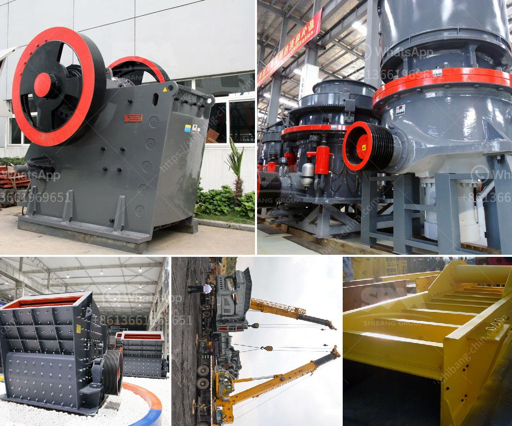

<h3>grinding or crushing for gypsum pdf</h3>
Gypsum, also known as calcium sulfate dihydrate, is a soft mineral that has been used as a construction material for centuries. In its raw form, gypsum is a rock-like substance that is naturally found in various parts of the world. However, before it can be utilized for different applications, such as wallboards, plaster, or cement, it needs to undergo a crucial step known as grinding or crushing.

Grinding or crushing gypsum involves breaking the mineral into smaller pieces to facilitate the manufacturing process. This step is essential as it allows the gypsum to be transformed into a fine powder that will later solidify when mixed with water. Additionally, grinding or crushing increases the gypsum's surface area, enhancing its reactivity when used as a binding agent or filler in construction materials.

Several methods are employed to grind or crush gypsum. One commonly utilized technique is the use of a ball mill, which grinds the gypsum into a powder by rotating a cylinder containing steel balls or pebbles. As the cylinder rotates, the balls or pebbles collide with the gypsum, breaking it into smaller particles. Another method involves the use of a hammer mill, which pulverizes the gypsum into fragments through high-speed, rotating hammers.

Grinding or crushing gypsum not only prepares it for further manufacturing processes but also imparts desired characteristics to the final product. For instance, grinding can control the particle size distribution of gypsum powder, ensuring consistent quality and improved workability in construction applications. Additionally, grinding can enhance the setting time and strength development of gypsum-based building materials.

In conclusion, grinding or crushing gypsum is an essential step in the manufacturing process of this versatile mineral. Whether it is ground into a powder through a ball mill or pulverized by a hammer mill, the grinding process ensures a fine and reactive gypsum product that can be used in a wide range of construction applications. Ultimately, this step plays a critical role in producing high-quality gypsum materials with enhanced properties and performance.
<h3>Contact us</h3><ul><li><strong>Whatsapp:&nbsp;<a href="https://wa.me/8613661969651">+8613661969651</a></strong></li><li><a href="https://swt.shibang-china.com/?git&amp;zhl&amp;grinding or crushing for gypsum pdf"><strong>Online Service(chat now)</strong></a></li></ul><h3>Related</h3><ul><li><a href='price of ballast crusher per ton in kenya.md'>price of ballast crusher per ton in kenya</a></li><li><a href='stone crusher machine in india.md'>stone crusher machine in india</a></li><li><a href='used triple horizontal vibrating screen for sale.md'>used triple horizontal vibrating screen for sale</a></li><li><a href='small scale gold processing line.md'>small scale gold processing line</a></li><li><a href='processing of limestone and crushing.md'>processing of limestone and crushing</a></li></ul>