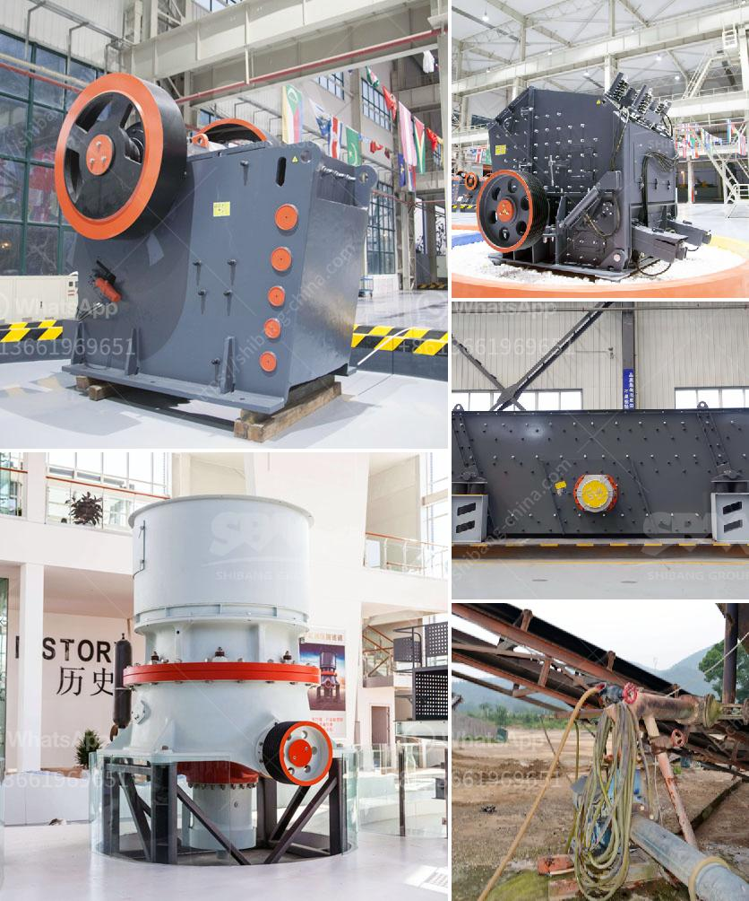

<h3>grinding plant in rajasthan</h3>
Rajasthan, a state in northern India, is known for its rich cultural heritage, picturesque landscapes, and historical monuments. However, it is also home to one of the largest grinding plant industries in the country. This grinding plant is a crucial part of the agricultural sector in Rajasthan and plays a significant role in the state's economy.

The grinding plant in Rajasthan primarily involves the processing of various grains and spices such as wheat, rice, maize, turmeric, and coriander. These raw materials are ground into powdered form, which is then used in various culinary practices and food preparations. The grinding plant ensures that these essential ingredients are processed efficiently, meeting the demands of both the local and international markets.

One of the key advantages of having a grinding plant in Rajasthan is the availability of abundant raw materials. The state is renowned for its fertile land and favorable climatic conditions, which make it ideal for the cultivation of a wide range of crops. This ensures a regular supply of grains and spices, further boosting the grinding plant's productivity.

Moreover, the grinding plant industry in Rajasthan provides employment opportunities to a significant number of individuals, contributing to the state's overall socio-economic development. From farmers and laborers involved in the production of raw materials to the skilled workers operating the grinding machinery, the industry provides livelihoods to both rural and urban populations.

The grinding plant industry in Rajasthan has also benefited from technological advancements. Modern grinding machinery, equipped with state-of-the-art technologies, ensures efficient and standardized processing of various grains and spices. This not only improves the quality of the final products but also increases the overall productivity of the grinding plant.

Furthermore, the grinding plant industry in Rajasthan has embraced sustainable practices to reduce its environmental impact. Efforts are being made to promote the use of renewable energy sources, such as solar power, in the operation of grinding machinery. Water conservation techniques are also implemented to minimize water wastage during the processing of raw materials.

The grinding plant industry in Rajasthan has a significant role in the state's export sector as well. The processed grains and spices from the grinding plant are in high demand both domestically and internationally. They are used as essential ingredients in various food products, including bread, pasta, sauces, and seasonings, to enhance flavor and aroma.

In conclusion, the grinding plant industry in Rajasthan is a vital component of the state's economy. It ensures the efficient processing of a wide range of grains and spices, meeting the demands of the local and international markets. With its abundant raw materials, technological advancements, and sustainability initiatives, the grinding plant industry in Rajasthan continues to prosper, contributing to the overall socio-economic growth of the state.
<h3>Contact us</h3><ul><li><strong>Whatsapp:&nbsp;<a href="https://wa.me/8613661969651">+8613661969651</a></strong></li><li><a href="https://swt.shibang-china.com/?git&amp;zhl&amp;grinding plant in rajasthan"><strong>Online Service(chat now)</strong></a></li></ul><h3>Related</h3><ul><li><a href='how much is a ball mill.md'>how much is a ball mill</a></li><li><a href='used rock crusher dealers in usa.md'>used rock crusher dealers in usa</a></li><li><a href='ball mill for grinding of soda feldspar.md'>ball mill for grinding of soda feldspar</a></li><li><a href='grinding zeolite ball mill machine.md'>grinding zeolite ball mill machine</a></li><li><a href='how to make silica rock pebles in ball mill.md'>how to make silica rock pebles in ball mill</a></li></ul>