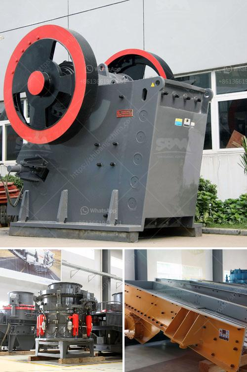

<h3>grinding raymond mill for sale</h3>
Raymond mill, also known as grinding mill, is a common industrial milling equipment, widely used in various industries such as mining, cement, and chemical industries. This machine is suitable for grinding various materials with Mohs hardness not greater than 9.3 and humidity below 6%. Its output range is 0.2-0.044mm, making it an ideal choice for many production lines.

There are several advantages of Raymond mill that make it a sought-after choice in the market. Firstly, it has a high-efficiency grinding capacity, allowing for the processing of large quantities of materials in less time. Additionally, the fineness of the finished product can be adjusted easily, ensuring that the desired particle size is achieved.

Furthermore, Raymond mill has a low energy consumption compared to other grinding mills, making it an energy-efficient option. This is achieved through the unique design of the grinding roller and grinding ring, which ensures a well-balanced distribution of material and reduces energy consumption.

When looking for a Raymond mill for sale, there are several factors to consider. Firstly, it is important to ensure that the machine is of high quality, with durable components that can withstand the demands of continuous operation. It is also vital to choose a Raymond mill that is suitable for the specific materials you intend to grind. Different materials have different hardness levels and require specific parameters for optimal grinding.

Additionally, the after-sales service provided by the manufacturer is crucial. This ensures that any issues or maintenance requirements can be promptly addressed, minimizing downtime and maximizing productivity.

In conclusion, Raymond mill is a reliable and efficient grinding machine suitable for various industries. With its high grinding capacity, adjustable fineness, and low energy consumption, it is a valuable asset in any production line. When purchasing a Raymond mill, quality, suitability for specific materials, and after-sales service should be taken into consideration. By investing in a high-quality Raymond mill, businesses can improve their grinding processes and ultimately increase their productivity.
<h3>Contact us</h3><ul><li><strong>Whatsapp:&nbsp;<a href="https://wa.me/8613661969651">+8613661969651</a></strong></li><li><a href="https://swt.shibang-china.com/?git&amp;zhl&amp;grinding raymond mill for sale"><strong>Online Service(chat now)</strong></a></li></ul><h3>Related</h3><ul><li><a href='stone crusher machine in india.md'>stone crusher machine in india</a></li><li><a href='sand washing plants.md'>sand washing plants</a></li><li><a href='crushing plant in maule.md'>crushing plant in maule</a></li><li><a href='sand in washing machine.md'>sand in washing machine</a></li><li><a href='stone crusher used equipment germany.md'>stone crusher used equipment germany</a></li></ul>