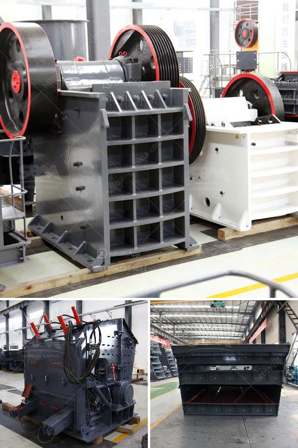

<h3>grinding rock into powder</h3>
For centuries, humans have valued rocks and minerals for their various uses in construction, industry, and art. From building materials to the creation of pigments and dyes, rocks have been an integral part of our society. One common practice associated with rocks is grinding them into powder, a process that has been used for thousands of years. But why do people grind rocks into powder, and what are its applications in today's world?

Grinding rocks into powder is a skill that has been perfected by humans over centuries. From ancient civilizations to modern societies, this practice has been employed for various purposes. One of the primary reasons for grinding rocks into powder is to extract valuable minerals trapped within the rock. These minerals can include gold, silver, copper, and many others.

Mining operations often involve crushing and grinding rocks into fine particles to extract the desired minerals. This process allows the minerals to be separated from the rest of the rock, making it easier to extract and refine them. By grinding rocks into powder, miners can release the valuable minerals and extract maximum value from the ore.

Grinding rocks into powder also has cultural and artistic significance. For instance, in ancient civilizations, grinding rocks into pigment powders was a common practice for creating paints and dyes. These pigments were then used to adorn buildings, pottery, and artwork. Even today, some artists grind rocks into powder to create custom pigments for their artwork, preserving this age-old practice.

In addition to minerals and pigments, grinding rocks into powder has several other applications. One such area is pharmaceuticals. Grinding rocks can create fine powders that can be used to produce medications. Many pharmaceuticals require the active ingredients to be in a powdered form for maximum effectiveness. By grinding rocks into powder, pharmaceutical companies can produce fine granules that are easier to incorporate into their products.

Moreover, grinding rocks into powder has environmental benefits. Recycling and reusing materials have become crucial aspects of sustainable development. By grinding rocks into powder, they can be upcycled and repurposed for various applications instead of being discarded. This process helps in reducing waste and promotes a circular economy.

When it comes to grinding rocks into powder, different techniques and tools are employed. Mortar and pestle, for instance, is an ancient tool still used today by many cultures. This traditional method involves using a heavy, concave mortar and a pestle to crush and grind rocks into a powder. Alternatively, modern machinery such as crushers and mills can also be used to grind rocks into fine particles efficiently.

In conclusion, grinding rocks into powder is a versatile practice that has been adopted by various industries throughout history. Whether for mining, artistic, pharmaceutical, or environmental purposes, grinding rocks can have numerous applications. By extracting valuable minerals, producing pigments, manufacturing medications, and promoting sustainability, this practice showcases the resourcefulness and ingenuity of humans throughout time. As we move towards a more sustainable future, grinding rocks into powder will continue to find new roles in our society.
<h3>Contact us</h3><ul><li><strong>Whatsapp:&nbsp;<a href="https://wa.me/8613661969651">+8613661969651</a></strong></li><li><a href="https://swt.shibang-china.com/?git&amp;zhl&amp;grinding rock into powder"><strong>Online Service(chat now)</strong></a></li></ul><h3>Related</h3><ul><li><a href='georgia country stone crusher.md'>georgia country stone crusher</a></li><li><a href='kenya cement plant.md'>kenya cement plant</a></li><li><a href='mobile screening plant south africa.md'>mobile screening plant south africa</a></li><li><a href='small scale gold processing line.md'>small scale gold processing line</a></li><li><a href='list of cement plants and their capacities.md'>list of cement plants and their capacities</a></li></ul>