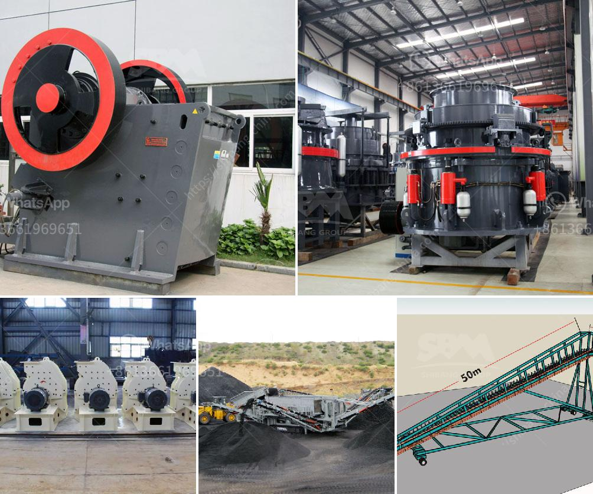

<h3>grinding roller mill machine</h3>
In today's industrial sector, grinding operations have become crucial for achieving optimum productivity. Grinding is the process of reducing the size of materials into fine particles, which enhances their surface area and enables efficient mixing, drying, and chemical reactions. One of the key machines used for grinding is the grinding roller mill machine.

A grinding roller mill machine is a versatile machine that is used to grind various materials such as minerals, ores, coal, and cement clinker. The grinding process is completed by grinding rollers that rotate against the grinding table. The material is pulverized by the grinding rollers and transmitted to the classifier, where the desired particle size is achieved.

One of the key advantages of a grinding roller mill machine is its energy efficiency. The machine is designed to minimize energy consumption while providing high grinding efficiency. This is achieved by utilizing the grinding rollers' rotational motion and minimizing friction. As a result, the machine can grind large quantities of material with minimal power consumption, making it an economical choice for grinding operations.

Another advantage of the grinding roller mill machine is its ability to grind materials of varying hardness. The machine's adjustable grinding pressure and speed allow it to handle a wide range of materials, from soft to hard. This versatility makes it suitable for grinding a variety of materials in different industries.

In addition to its energy efficiency and versatility, the grinding roller mill machine offers several other benefits. One of these is its low maintenance requirements. The machine is designed to operate continuously with minimal downtime, reducing the need for costly maintenance and repairs. This ensures maximum uptime and productivity, making it an ideal choice for industries that rely heavily on continuous grinding operations.

Furthermore, the grinding roller mill machine is equipped with advanced control systems that enable precise monitoring and control of the grinding process. These control systems ensure consistent and accurate grinding results, allowing operators to achieve the desired particle size and quality. The machine's digital controls and automation also contribute to higher safety standards, minimizing the risk of accidents and errors.

Moreover, grinding roller mill machines are designed for easy installation and operation. They are compact in size and can be easily integrated into existing grinding systems. This makes it convenient for industries to upgrade their grinding operations without significant modifications to the existing infrastructure.

In conclusion, a grinding roller mill machine is an essential tool for efficient grinding operations in various industries. Its energy efficiency, versatility, low maintenance requirements, and advanced control systems make it the ultimate solution for grinding a wide range of materials with precision and efficiency. So, whether it's minerals, ores, coal, or cement clinker, a grinding roller mill machine is the dependable choice for achieving superior grinding results.
<h3>Contact us</h3><ul><li><strong>Whatsapp:&nbsp;<a href="https://wa.me/8613661969651">+8613661969651</a></strong></li><li><a href="https://swt.shibang-china.com/?git&amp;zhl&amp;grinding roller mill machine"><strong>Online Service(chat now)</strong></a></li></ul><h3>Related</h3><ul><li><a href='crushing and grinding processes of platinum.md'>crushing and grinding processes of platinum</a></li><li><a href='used stone crusher for sale in dubai.md'>used stone crusher for sale in dubai</a></li><li><a href='sell jaw crusher jaw pe 250x400 tph.md'>sell jaw crusher jaw pe 250x400 tph</a></li><li><a href='vibrating screen for aggregates.md'>vibrating screen for aggregates</a></li><li><a href='horizontal impact crusher for sale.md'>horizontal impact crusher for sale</a></li></ul>