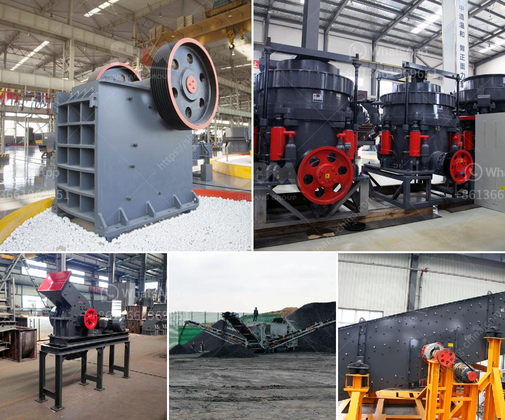

<h3>grinding roller mill</h3>
Grinding is an essential operation in numerous industries, including mining, cement, and pharmaceuticals, among others. The process of reducing particle size ensures the production of fine, homogeneous powders or highly dispersive materials. Over the years, various types of mills have been developed to cater to different grinding requirements. One such mill that has gained significant popularity due to its efficiency and versatility is the grinding roller mill.

A grinding roller mill, also known as a vertical roller mill or VRM, works by utilizing a rotating grinding table with vertically positioned rollers. As the material enters the mill, it is crushed between the grinding roller and the grinding table. The grinding rollers exert force on the material, grinding it into particles of the desired size. To ensure uniform grinding, advanced designs employ multiple grinding rollers, with each roller exerting distinct pressure on the material.

One of the key advantages of a grinding roller mill is its ability to handle a wide range of materials with varying hardness, moisture content, and particle size distribution. From limestone to coal, from clinker to slag, a well-designed roller mill can efficiently grind different types of materials, enabling manufacturers to achieve the desired product specifications. This versatility ensures that grinding roller mills find applications in various industries, where grinding is an integral part of the production process.

Another significant advantage of grinding roller mills is their energy efficiency. Compared to traditional ball mills, which rely on impact and attrition forces for grinding, roller mills utilize their grinding rollers' pressure, resulting in lower energy consumption. Moreover, roller mills can be equipped with additional equipment, such as pre-grinders, separators, and drying systems, further enhancing energy efficiency and overall performance.

In addition to energy efficiency, roller mills offer improved control over the grinding process. Variable speed drives and automated control systems allow manufacturers to optimize the grinding parameters, such as feed rate, grinding pressure, and table rotation speed, ensuring consistent product quality and minimizing wastage. Additionally, modern roller mills often incorporate advanced instrumentation and real-time monitoring systems, enabling operators to monitor and adjust the grinding process for optimal results.

During the grinding process, roller mills generate less noise and dust emissions compared to other grinding technologies. This is particularly crucial in environments where worker safety and environmental protection are of utmost importance. Reduced noise levels and dust emissions result in better working conditions and compliance with stringent health and safety regulations.

In conclusion, a grinding roller mill offers various advantages over traditional grinding technologies. Its versatility, energy efficiency, improved control, and reduced noise and dust emissions make it an attractive choice for manufacturers across different industries. As new advancements continue to enhance the design and performance of grinding roller mills, it is expected that their popularity and application will continue to grow, enabling manufacturers to achieve efficient and sustainable grinding processes.
<h3>Contact us</h3><ul><li><strong>Whatsapp:&nbsp;<a href="https://wa.me/8613661969651">+8613661969651</a></strong></li><li><a href="https://swt.shibang-china.com/?git&amp;zhl&amp;grinding roller mill"><strong>Online Service(chat now)</strong></a></li></ul><h3>Related</h3><ul><li><a href='ball mill for grinding of soda feldspar.md'>ball mill for grinding of soda feldspar</a></li><li><a href='kenya quarry crusher.md'>kenya quarry crusher</a></li><li><a href='equipment needed for quarry crusher.md'>equipment needed for quarry crusher</a></li><li><a href='raymond vertical mill product size 3 30 micron.md'>raymond vertical mill product size 3 30 micron</a></li><li><a href='manufacturing process of portland slag cement.md'>manufacturing process of portland slag cement</a></li></ul>