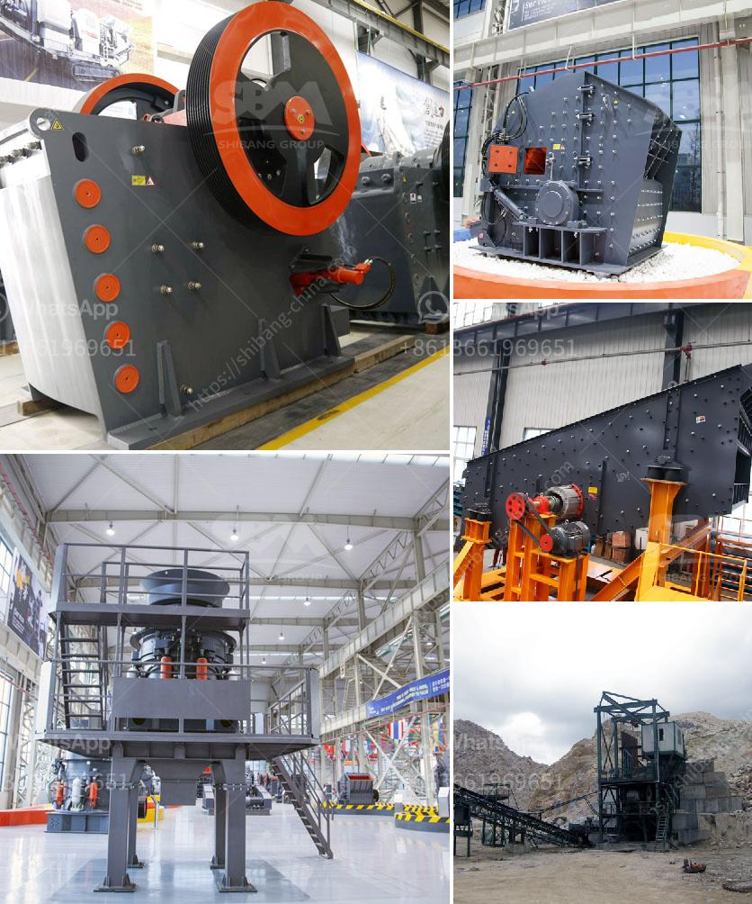

<h3>grinding zeolite ball mill machine</h3>
Zeolites are natural aluminosilicate minerals with unique physical and chemical properties. These minerals are widely used in various applications, including agriculture, water purification, gas separation, and catalysis. Zeolites are highly porous materials with uniform pore sizes, making them ideal for molecular sieving and adsorption processes. In recent years, the demand for nano-sized zeolite particles has grown significantly due to their enhanced reactivity and improved performance in various applications.

To obtain nano-sized zeolite particles, it is essential to use advanced milling equipment. The ball mill machine is an effective tool for grinding and blending materials, efficiently manufacturing homogeneous nanoscale particles. With the application of mechanical energy, various manufacturers have developed different milling machines for substances such as zeolite.

The ball mill machine is widely used in the mining, construction, metallurgy, chemical and other industries. It can be used for grinding many different types of materials, such as limestone, clay, clinker, metal powders, cement, and even pharmaceuticals. In addition, the ball mill machine can also be used for mixing and dispersing solid particles in liquids, such as paint, pigments, and adhesives.

Grinding zeolite ball mill machine may be the most common grinding mill in zeolite mining equipment. In industrial production, using a zeolite ball mill machine for grinding zeolite has many advantages. For example, high production efficiency, the finished zeolite products will have uniform particle size distribution, and it can also provide strong adaptability to materials. In addition, using a zeolite ball mill machine has the benefit of low energy consumption and low noise levels.

The ball milling process is an effective method to grind zeolite particles into nanoparticles. In this process, grinding media (such as ceramic or stainless-steel balls) of different sizes are used to provide particle size reduction through attrition and compressive forces. The grinding media and the material to be ground are placed in a rotating container (usually a cylindrical jar) and subjected to continuous impacts and friction, resulting in the breakdown of larger particles into smaller ones.

During ball milling, the grinding media exert mechanical forces on the zeolite particles, leading to particle fracture, structural deformation, and even chemical reactions. The size reduction is a result of the combined effect of impact and attrition forces. As the milling process progresses, the zeolite particles are gradually reduced in size, reaching the desired particle size distribution.

The effectiveness of the ball milling process is influenced by several factors, including the milling time, the ball-to-powder ratio, the rotational speed of the mill, and the material properties of the zeolite. Optimizing these parameters allows for the production of zeolite nanoparticles with specific characteristics, such as narrow size distribution and high purity.

Grinding zeolite ball mill machine is an effective tool for manufacturing nano-sized zeolite particles. It not only improves the quality of zeolite products but also provides unparalleled energy efficiency. The use of advanced ball milling machines in zeolite manufacturing allows for the production of high-quality zeolite particles with enhanced properties and performance.

In the future, continued development and improvement of ball mill machines will further advance the production of nano-sized zeolite particles and explore their potential applications in various fields. With the growing demand for efficient and sustainable technologies, grinding zeolite ball mill machines will play an increasingly important role in the synthesis of innovative materials.
<h3>Contact us</h3><ul><li><strong>Whatsapp:&nbsp;<a href="https://wa.me/8613661969651">+8613661969651</a></strong></li><li><a href="https://swt.shibang-china.com/?git&amp;zhl&amp;grinding zeolite ball mill machine"><strong>Online Service(chat now)</strong></a></li></ul><h3>Related</h3><ul><li><a href='stone crushers machine price in nepal.md'>stone crushers machine price in nepal</a></li><li><a href='crushing plant working.md'>crushing plant working</a></li><li><a href='limestone jaw crusher sizes.md'>limestone jaw crusher sizes</a></li><li><a href='iron sand arator in philippines.md'>iron sand arator in philippines</a></li><li><a href='calcium carbonate milling machine.md'>calcium carbonate milling machine</a></li></ul>