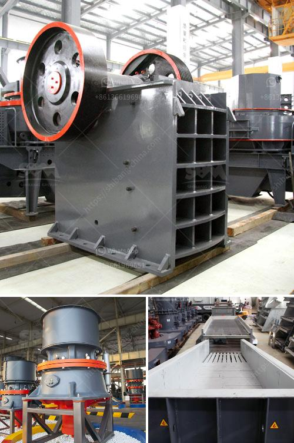

<h3>gypsum ball mill manufacturing machine</h3>
Gypsum is a mineral compound commonly used in the construction industry. It is a versatile material that can be utilized in various forms, including as a binder in drywall, as a soil conditioner, and as a component in plaster of Paris. The manufacturing process of gypsum involves crushing and grinding the mineral into a fine powder, which is then used to manufacture different products.

One vital piece of equipment used in the gypsum grinding process is the gypsum ball mill. These machines are used for efficiently grinding gypsum in order to prepare it for further processing. A renowned manufacturer and supplier, Liming Heavy Industry Machinery Co. Ltd., offers a wide range of gypsum ball mills that are finely crafted to meet the needs of businesses operating in the construction industry.

The gypsum ball mill machines offered by Liming Heavy Industry Machinery Co. Ltd. are robust and durable, ensuring high efficiency and long-lasting performance. These machines are equipped with advanced technology and innovative features that make them easy to operate and maintain. With their user-friendly interfaces, operators can easily adjust and control various parameters to achieve the desired fineness of the ground gypsum.

The gypsum ball mills manufactured by Liming Heavy Industry Machinery Co. Ltd. are also energy efficient. They are designed to minimize energy consumption while maximizing grinding efficiency. This not only helps businesses reduce their energy costs but also contributes to a more sustainable and eco-friendly manufacturing process.

In addition to their efficiency and durability, the gypsum ball mills manufactured by Liming Heavy Industry Machinery Co. Ltd. are also known for their versatility. These machines can be used for grinding gypsum of different sizes and moisture contents. They can handle both dry and wet grinding processes, making them suitable for a wide range of applications. Whether it is grinding gypsum for use in the construction industry or preparing gypsum for further processing, these machines are designed to deliver exceptional performance.

Moreover, Liming Heavy Industry Machinery Co. Ltd. provides comprehensive after-sales support for their gypsum ball mills. The company offers installation and training services to help businesses set up and operate the machines effectively. They also provide regular maintenance services to ensure optimal performance and prolong the lifespan of the equipment. By offering such comprehensive support, Liming Heavy Industry Machinery Co. Ltd. strives to develop long-term partnerships with its customers and provide them with the best possible solutions for their gypsum grinding needs.

In conclusion, the gypsum ball mill manufacturing machines offered by Liming Heavy Industry Machinery Co. Ltd. combine efficiency, durability, and versatility to meet the needs of businesses operating in the construction industry. These machines are designed to deliver high-quality grinding results while minimizing energy consumption. With their advanced technology and user-friendly interfaces, they are easy to operate and maintain. By providing comprehensive after-sales support, Liming Heavy Industry Machinery Co. Ltd. ensures that its customers can maximize the performance of the equipment and achieve their production goals efficiently.
<h3>Contact us</h3><ul><li><strong>Whatsapp:&nbsp;<a href="https://wa.me/8613661969651">+8613661969651</a></strong></li><li><a href="https://swt.shibang-china.com/?git&amp;zhl&amp;gypsum ball mill manufacturing machine"><strong>Online Service(chat now)</strong></a></li></ul><h3>Related</h3><ul><li><a href='marble crusher cost.md'>marble crusher cost</a></li><li><a href='ball mill to buy in peru.md'>ball mill to buy in peru</a></li><li><a href='gypsum crusher plants in india.md'>gypsum crusher plants in india</a></li><li><a href='rubble recycle concrete crusher hire.md'>rubble recycle concrete crusher hire</a></li><li><a href='central crushing granite.md'>central crushing granite</a></li></ul>