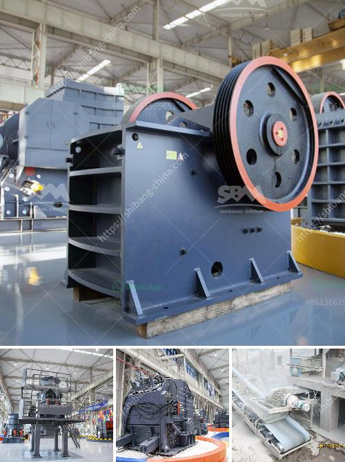

<h3>gypsum board making machine price in pakistan</h3>
Gypsum board is a popular building material used for walls and ceilings in Pakistan and abroad. It is composed of gypsum, a soft sulfate mineral, and is widely available in various forms. Gypsum board making machines are essential in the gypsum board manufacturing process. They help the gypsum board industry to produce high-quality gypsum boards efficiently.

The gypsum board making machine price in Pakistan depends on the capacity and the specifications of the machine. The average price of a basic gypsum board making machine starts from around Rs. 1,800,000.

The price of gypsum board making machines may vary significantly based on the brand, manufacturer, and seller. It is important to consider several factors before making a purchase decision, such as the machine's quality, after-sales service, warranty period, and maintenance requirements.

In Pakistan, there are several manufacturers and suppliers of gypsum board making machines. These companies offer various models with different capacities and features to suit the production needs of different customers. Some of the popular brands in Pakistan include Hengshui Dechen Machinery, China Gypsum Board Machinery, and Shijiazhuang Wuxing Mechanical Co. Ltd.

When comparing prices and specifications, it is crucial to consider the production capacity of the machine. Higher capacity machines are usually more expensive but can produce a larger volume of gypsum boards in a shorter time. However, for small-scale businesses or startups, a machine with a lower production capacity may be more cost-effective.

Apart from the production capacity, other features and specifications also impact the price of the gypsum board making machine. These include the width and thickness of the boards that can be produced, the power requirements, automation level, and the quality of the finished boards.

It is advisable to request quotations from multiple suppliers and compare the prices, specifications, and after-sales services offered by each. Additionally, it is essential to verify the reputation and reliability of the supplier before purchasing the machine, as this can greatly impact the overall experience and performance of the machine.

While the initial investment in a gypsum board making machine may seem significant, it is essential to consider the long-term benefits and cost savings. Efficient machines can streamline the production process, reduce labor costs, and produce high-quality gypsum boards, leading to increased profitability and customer satisfaction.

In conclusion, the gypsum board making machine price in Pakistan varies depending on the machine's capacity and specifications. It is crucial to conduct thorough research, compare prices and features, and choose a reliable supplier to ensure the best value for money. Investing in a high-quality machine can greatly benefit the gypsum board industry in Pakistan and contribute to its growth and success.
<h3>Contact us</h3><ul><li><strong>Whatsapp:&nbsp;<a href="https://wa.me/8613661969651">+8613661969651</a></strong></li><li><a href="https://swt.shibang-china.com/?git&amp;zhl&amp;gypsum board making machine price in pakistan"><strong>Online Service(chat now)</strong></a></li></ul><h3>Related</h3><ul><li><a href='china stone crusher machine.md'>china stone crusher machine</a></li><li><a href='how to grind silica sand.md'>how to grind silica sand</a></li><li><a href='conveyor belts manufacturers south africa.md'>conveyor belts manufacturers south africa</a></li><li><a href='calcite powder grinding mill sale.md'>calcite powder grinding mill sale</a></li><li><a href='ball mill to grind quartz.md'>ball mill to grind quartz</a></li></ul>