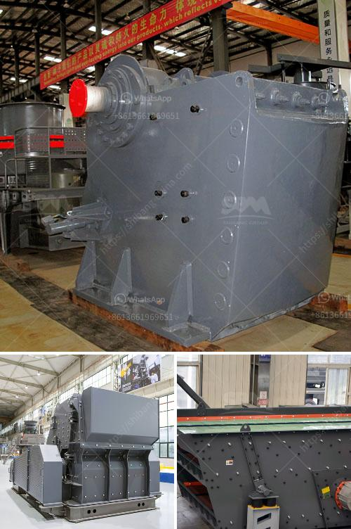

<h3>gypsum board manufacturing plant</h3>
Gypsum board, also known as drywall or plasterboard, is a building material widely used in construction projects for its lightweight, fire-resistant, and soundproofing properties. It is made from gypsum, a naturally occurring mineral found in abundance all over the world. To meet the growing demand for gypsum board in the construction industry, manufacturers have established gypsum board manufacturing plants.

A gypsum board manufacturing plant is a facility where gypsum is heated to remove the water content and converted into gypsum powder, which is then mixed with water to form a slurry. This slurry is then sandwiched between two layers of paper and dried to produce gypsum boards.

The process of manufacturing gypsum boards starts with mining gypsum from underground or open-pit mines. The extracted gypsum is then crushed and processed to remove impurities and form gypsum powder. The gypsum powder is then mixed with water to form a slurry, which is poured onto a continuous moving sheet of paper.

On both sides of the slurry, another sheet of paper is placed to sandwich the slurry. This sandwiched slurry and paper are then passed through a set of rollers, which squeezes out the excess water and forms a continuous flat board. The boards are then cut to the desired size and transferred to a drying chamber, where they are dried using hot air. The drying process removes the remaining moisture, making the boards ready for packaging and distribution.

The gypsum board manufacturing plant requires a significant amount of investment in terms of machinery, equipment, and infrastructure. The plant should have sufficient space for the storage and handling of raw materials, the production process, and the storage of finished products. It also needs a steady supply of electricity and water for its operations.

The location of the manufacturing plant is crucial, as it should be close to gypsum mines to ensure a steady supply of raw materials. It should also be accessible to transportation networks to facilitate the delivery of finished products to construction sites.

Gypsum board manufacturing plants are typically automated and equipped with modern technology to ensure efficiency and quality in the production process. Advanced systems control the entire manufacturing process, from the mixing of raw materials to the formation and drying of gypsum boards. Quality control measures are implemented at every stage to ensure the boards meet the required standards and specifications.

The demand for gypsum boards is steadily increasing due to the growth in the construction industry. Gypsum boards are widely used in commercial, residential, and industrial projects for constructing walls, ceilings, and partitions. They offer numerous advantages such as ease of installation, durability, and fire-resistance, making them a preferred choice for architects, contractors, and homeowners.

In conclusion, a gypsum board manufacturing plant plays a vital role in meeting the demand for gypsum boards in the construction industry. The plant converts gypsum into gypsum powder, which is mixed with water and paper to produce gypsum boards. The manufacturing process requires investment in machinery, equipment, and infrastructure to ensure efficient and high-quality production. With the increasing demand for gypsum boards, these manufacturing plants contribute to the growth of the construction industry.
<h3>Contact us</h3><ul><li><strong>Whatsapp:&nbsp;<a href="https://wa.me/8613661969651">+8613661969651</a></strong></li><li><a href="https://swt.shibang-china.com/?git&amp;zhl&amp;gypsum board manufacturing plant"><strong>Online Service(chat now)</strong></a></li></ul><h3>Related</h3><ul><li><a href='machine to crush limestone in south africa.md'>machine to crush limestone in south africa</a></li><li><a href='roller mill from china.md'>roller mill from china</a></li><li><a href='slag peralatan pabrik vertikal.md'>slag peralatan pabrik vertikal</a></li><li><a href='calcium carbonate plant price.md'>calcium carbonate plant price</a></li><li><a href='roller mill sizes.md'>roller mill sizes</a></li></ul>