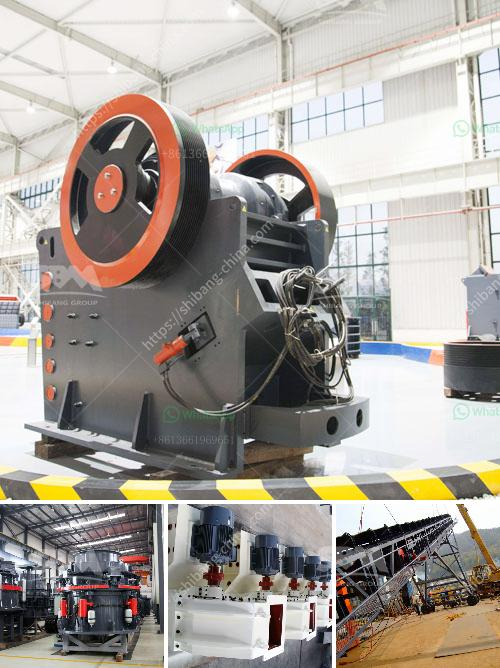

<h3>gypsum board plant initial investment</h3>
When considering starting a gypsum board plant, the initial investment is a critical factor to take into account. The cost of setting up a gypsum board manufacturing plant can vary depending on several factors such as the location, size of the plant, machinery and equipment requirements, and market demand.

The location of the plant plays a significant role in determining the initial investment. If the plant is situated in an area with readily available gypsum deposits, it can significantly reduce the cost of raw materials and transportation expenses. On the other hand, setting up a plant in a region with limited gypsum resources might require additional investment in importing gypsum from other areas.

The size of the plant also affects the initial investment. A larger plant would require more land, machinery, and equipment, resulting in higher costs. However, a larger plant can also have economies of scale, leading to lower production costs in the long run.

The machinery and equipment required for a gypsum board plant can vary depending on the desired production capacity and automation level. The cost of these machines can range from thousands to millions of dollars. Investing in high-quality machinery and equipment is crucial to ensure efficient and reliable production processes.

Market demand is another essential factor to consider. Conducting a thorough market analysis can provide insights into the potential demand for gypsum board in the targeted region or market. It is crucial to assess factors such as population growth, construction activities, and the presence of competitors to estimate the plant's profitability.

Overall, the initial investment for setting up a gypsum board plant can range from moderate to high depending on various factors. It is recommended to conduct a feasibility study and seek professional guidance to determine the precise investment required based on specific circumstances. Careful planning and analysis will help ensure a successful and profitable venture in the gypsum board manufacturing industry.
<h3>Contact us</h3><ul><li><strong>Whatsapp:&nbsp;<a href="https://wa.me/8613661969651">+8613661969651</a></strong></li><li><a href="https://swt.shibang-china.com/?git&amp;zhl&amp;gypsum board plant initial investment"><strong>Online Service(chat now)</strong></a></li></ul><h3>Related</h3><ul><li><a href='rock crushers ball mill.md'>rock crushers ball mill</a></li><li><a href='dry process of cement manufacturing.md'>dry process of cement manufacturing</a></li><li><a href='business plan for marble and granite factory pdf.md'>business plan for marble and granite factory pdf</a></li><li><a href='quartz plass grinder price.md'>quartz plass grinder price</a></li><li><a href='coal pulverizer machine price.md'>coal pulverizer machine price</a></li></ul>