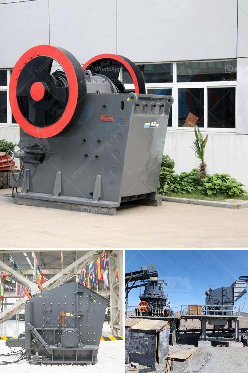

<h3>gypsum calcining equipment price</h3>
Gypsum calcining equipment refers to the machines used to produce gypsum powder. Gypsum powder is an essential material in many industries, including construction, agriculture, and chemical engineering. It is used to make wallboard, cement, and as a soil amendment for agricultural purposes.

The price of gypsum calcining equipment varies depending on several factors, such as the capacity and specifications of the machine. Generally, small-sized gypsum calcining equipment is cheaper than large-sized machines. However, it is important to note that the price is not the only factor to consider when purchasing this equipment.

The quality of the machine is equally important. High-quality gypsum calcining equipment not only ensures efficient production but also reduces maintenance costs in the long run. It is advisable to choose equipment from reputable manufacturers with a track record of providing reliable and durable machines. Such manufacturers usually offer competitive prices that justify the quality of their equipment.

Another factor to consider is the after-sales service provided by the manufacturer. This includes technical support, spare parts availability, and warranty terms. Equipment breakdowns can cause production delays and incur additional costs. Therefore, it is important to choose a manufacturer who can provide prompt technical support and readily available spare parts to minimize downtime.

Additionally, it is advisable to compare prices from different manufacturers and suppliers to get the best deal. There are numerous suppliers in the market, each offering different prices and packages. By comparing prices and evaluating the overall value provided by each supplier, one can make an informed decision and choose the most cost-effective option.

In conclusion, the price of gypsum calcining equipment varies depending on several factors, including capacity, specifications, quality, and after-sales service. It is important to consider these factors and choose a reputable manufacturer who provides reliable machines and comprehensive after-sales support. By doing so, one can ensure efficient production and maximize the return on investment.
<h3>Contact us</h3><ul><li><strong>Whatsapp:&nbsp;<a href="https://wa.me/8613661969651">+8613661969651</a></strong></li><li><a href="https://swt.shibang-china.com/?git&amp;zhl&amp;gypsum calcining equipment price"><strong>Online Service(chat now)</strong></a></li></ul><h3>Related</h3><ul><li><a href='crusher mill sales in malaysia.md'>crusher mill sales in malaysia</a></li><li><a href='quarry crusher zimbabwe.md'>quarry crusher zimbabwe</a></li><li><a href='mobile iron ore jaw crusher for hire in india.md'>mobile iron ore jaw crusher for hire in india</a></li><li><a href='jaw crusher buatan philippines 250 ton hari.md'>jaw crusher buatan philippines 250 ton hari</a></li><li><a href='cement clinker mill suppliers in turkey.md'>cement clinker mill suppliers in turkey</a></li></ul>