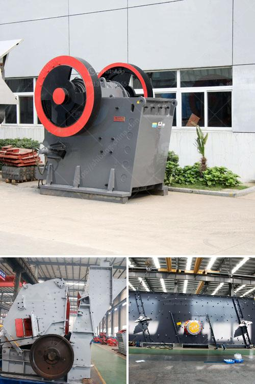

<h3>gypsum crusher plants in india</h3>
Gypsum, a mineral found in abundance in nature, is widely used for various purposes in industries. One of the key applications of gypsum is in the construction industry, where it is used to produce plaster of Paris, drywall, and other building materials. To meet the growing demand for gypsum in India, numerous gypsum crusher plants have been established across the country.

A gypsum crusher plant is a machine that is designed to crush gypsum into small pieces or granules for easier transportation and further processing. The gypsum crushing process is usually carried out in two or three stages – primary crushing, secondary crushing, and tertiary crushing. The primary crusher is a jaw crusher that processes the gypsum into smaller pieces, which will then be transported to the secondary crusher for further crushing. In some cases, cone crushers or impact crushers are used in the secondary crushing stage.

India has a rich reserve of gypsum, ranging from small deposits to large-scale mines. Due to the abundance of gypsum resources, India has been a major producer and exporter of gypsum globally. The establishment of gypsum crusher plants in India has been driven by the growth in the construction industry and the increasing demand for gypsum products in the country.

These crusher plants not only provide an efficient and reliable way to process gypsum, but they also contribute to the economic development of the regions where they are located. The establishment of these plants has created job opportunities and stimulated local businesses, such as transportation, maintenance services, and raw material suppliers.

Furthermore, the availability of locally manufactured gypsum products has reduced the cost of construction in India. Previously, gypsum products had to be imported, which added logistics costs and increased the final price of construction materials. With the establishment of gypsum crusher plants in India, the construction industry can now access quality gypsum products at reasonable prices.

In conclusion, gypsum crusher plants in India have played a vital role in the development of the construction industry. These plants have not only met the growing demand for gypsum products but have also contributed to the economic growth and job creation in the regions where they are operating. With the continued development of infrastructure and construction projects in India, the demand for gypsum is expected to increase further, making the gypsum crusher plants crucial for the country's development.
<h3>Contact us</h3><ul><li><strong>Whatsapp:&nbsp;<a href="https://wa.me/8613661969651">+8613661969651</a></strong></li><li><a href="https://swt.shibang-china.com/?git&amp;zhl&amp;gypsum crusher plants in india"><strong>Online Service(chat now)</strong></a></li></ul><h3>Related</h3><ul><li><a href='turkey plant production line of gypsum powder.md'>turkey plant production line of gypsum powder</a></li><li><a href='stone crusher hammer mill.md'>stone crusher hammer mill</a></li><li><a href='ball mill ball portable.md'>ball mill ball portable</a></li><li><a href='cost of mini pulvrizers crusher.md'>cost of mini pulvrizers crusher</a></li><li><a href='stone crusher company in dubai.md'>stone crusher company in dubai</a></li></ul>