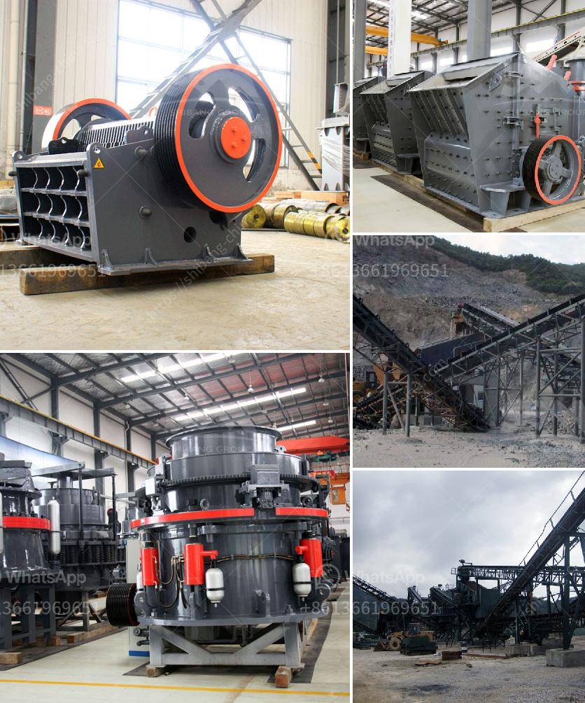

<h3>gypsum crushing machines in pakistan</h3>
Gypsum is one of the important industrial minerals widely used in construction and building materials. It is a soft sulfate mineral with the chemical formula CaSO4·2H2O. Gypsum plays a crucial role in the cement industry, where it is used as a retarder to control the setting time of cement. It is also used in the production of plaster of Paris, wallboard, fertilizer, and soil stabilizer. In Pakistan, gypsum is abundantly available and widely mined throughout the country.

When it comes to processing gypsum ore, Pakistan has several crushing machines available. Jaw crusher is the widely used primary crushing machine, and it is used for coarse crushing process in quarry plant. Impact crusher or cone crusher is generally used as the secondary crushing machine. Impact crusher has the advantage of large crushing ratio, high crushing efficiency, and good cubic shape, while a cone crusher produces a more elongated and flatter product.

In Pakistan, renowned manufacturers and suppliers of gypsum crushing machines process gypsum ore. Zenith, the pioneer in gypsum crushing technology, offers a comprehensive range of high-quality gypsum crushing machines. These gypsum crushers feature advanced technology, reliable operation, and easy maintenance. They are well known for their superior performance, high-quality product, and highly automated systems.

Gypsum crushing machines in Pakistan are widely used in mining, smelting, building materials, roads, railways, water conservancy, and chemical industries. Gypsum crushing machine has a wide range of applications, including industrial materials such as glass, ceramics, and cement. It is also used as a fertilizer and soil treatment agent in agriculture.

Gypsum crushing machines in Pakistan are widely used in the mining industry. Gypsum crushing equipment is an important crushing equipment to crush the large gypsum ore into small particle size in Pakistan. Rock gypsum is mined by open-pit or quarrying methods. The gypsum crushing process can be operated in underground mining or mining on the surface.

Gypsum crushing machines in Pakistan include jaw crusher, impact crusher, cone crusher, hammer crusher, rotary crusher, and single-stage crusher, etc. Long-term use of some gypsum crushing machines will cause problems such as corrosion and rusting. Therefore, we need to carry out regular maintenance, maintenance and repair of equipment to ensure its normal operation.

The gypsum crushing machine ensures that the equipment is running reliably, achieves convenient maintenance, high crushing efficiency, and low operation and management costs, reducing the workload of technicians and greatly improving gypsum crushing efficiency. It has been widely used in gypsum crushing operations worldwide.

In conclusion, gypsum is a valuable mineral resource in Pakistan. Gypsum crushing machines in Pakistan have widely applications in mining, smelting, building materials, roads, railways, water conservancy, and chemical industries. The long-term use of gypsum crushing machines will cause corrosion and rusting, but through regular maintenance, maintenance, and repair, the equipment can run reliably, achieve high crushing efficiency, and low operation and management costs. It can reduce the workload of technicians and greatly improve gypsum crushing efficiency.
<h3>Contact us</h3><ul><li><strong>Whatsapp:&nbsp;<a href="https://wa.me/8613661969651">+8613661969651</a></strong></li><li><a href="https://swt.shibang-china.com/?git&amp;zhl&amp;gypsum crushing machines in pakistan"><strong>Online Service(chat now)</strong></a></li></ul><h3>Related</h3><ul><li><a href='granite quarry crusher in nigeria.md'>granite quarry crusher in nigeria</a></li><li><a href='chromite beneficiation plants malaysia.md'>chromite beneficiation plants malaysia</a></li><li><a href='marble crusher cost.md'>marble crusher cost</a></li><li><a href='small scale gold mining using stamp mill.md'>small scale gold mining using stamp mill</a></li><li><a href='portable crushers.md'>portable crushers</a></li></ul>