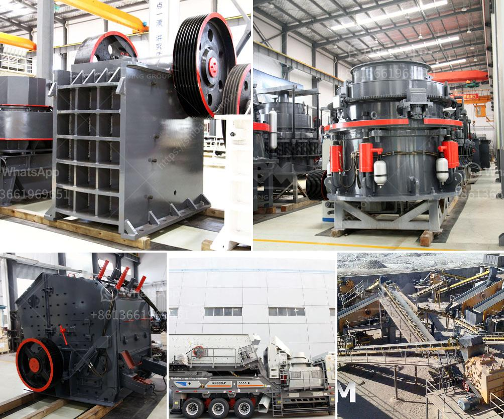

<h3>gypsum crushing plant price in pakistan</h3>
Gypsum is a widely used industrial material and building material. Gypsum is an important raw material for various industrial applications, such as cement production, papermaking, and construction. Due to its excellent performance, gypsum is widely used and has a high market value. In Pakistan, where there is a large demand for gypsum, crushers are used to crush gypsum into small particles for use in various industries.

For gypsum crushing plants, the price of gypsum jaw crusher, crusher plant sale price in pakistan, granite crusher crushing plant, widely used in pakistan gypsum crushing plant price in pakistan as a leading global manufacturer of crushing, grinding and mining equipments, we offer advanced, reasonable solutions for anyel size-reduction requirements including quarry, aggregate, and different kinds of minerals. gypsum crushing plant in pakistan-stone crusher sale price

As a professional crusher machine manufacturer, we have produced various types of crusher machines to meet different clients’ production requirements. Each crusher machine has different specifications and price. It is recommended that you contact our customer service personnel to get the latest price of gypsum crushing plant in Pakistan.

The price of gypsum crushing plant in Pakistan is affected by many factors, including input size, productivity, capacity, etc. If you want to know the exact gypsum crushing plant price in Pakistan, please contact us, we will give you a satisfactory answer.

DSMAC is the supplier of crushing equipment for rock and minerals processing industries. We provide complete range of gypsum crusher machine in Pakistan for sale, such as jaw crusher, impact crusher, cone crusher, gyratory crusher, VSI crusher etc. They are available in stationary, portable and mobile applications. Ultimately, we aim to provide high-efficiency crushing equipment for mining industry.

In conclusion, if you want to know the gypsum crushing plant price in Pakistan, either leave a message on our website or contact our online customer service. We will provide you with the most satisfactory answer. With our rich experience in the production and sales of gypsum crushers, we believe that we can meet your needs and provide you with high-quality crushing equipment.
<h3>Contact us</h3><ul><li><strong>Whatsapp:&nbsp;<a href="https://wa.me/8613661969651">+8613661969651</a></strong></li><li><a href="https://swt.shibang-china.com/?git&amp;zhl&amp;gypsum crushing plant price in pakistan"><strong>Online Service(chat now)</strong></a></li></ul><h3>Related</h3><ul><li><a href='rotary kiln cement plant cost in india.md'>rotary kiln cement plant cost in india</a></li><li><a href='grinding mill sale.md'>grinding mill sale</a></li><li><a href='recycling machines stone production.md'>recycling machines stone production</a></li><li><a href='quartz stone machine price.md'>quartz stone machine price</a></li><li><a href='roller mill manufacturers.md'>roller mill manufacturers</a></li></ul>