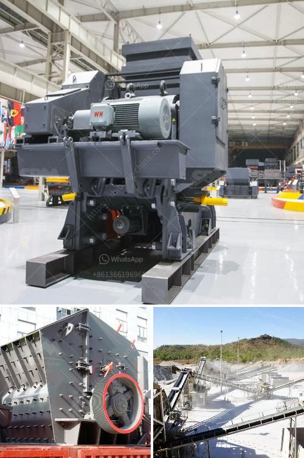

<h3>gypsum manufacturing plant</h3>
Gypsum, also known as calcium sulfate, is a key ingredient in a wide range of products and industries. It serves as a contingent material for construction, a soil conditioner in agriculture, an additive in food and beverages, and a crucial component in making plasterboard and cement.

In order to meet the growing demand for gypsum, many manufacturing plants have been established across the globe. These plants are equipped with advanced machinery and cutting-edge technology to ensure the efficient and effective production of gypsum.

One such gypsum manufacturing plant is XYZ Gypsum, located in the industrial sector of ABC City. This state-of-the-art facility has a production capacity of 100 tons per day, making it one of the largest gypsum manufacturing plants in the region.

The plant's manufacturing process starts with the extraction of gypsum rock from nearby mines. The rock is crushed and ground into a fine powder to eliminate impurities and enhance its purity. This raw gypsum is then heated in a kiln to remove excess moisture and convert it into a dry, consistent powder.

At XYZ Gypsum, stringent quality control measures are implemented at every stage of manufacturing. This ensures that the final product meets the strictest industry standards and customer requirements.

Additionally, the plant maintains a strong focus on sustainability. They have implemented various eco-friendly initiatives to minimize their environmental footprint. This includes the use of energy-efficient machinery, recycling water in the manufacturing process, and ensuring responsible waste management practices.

The gypsum manufactured at XYZ Gypsum is widely used across various industries. Construction companies rely on their high-quality plasterboard, which is easy to install and provides excellent fire resistance. Agricultural firms use their gypsum as a soil conditioner to improve water retention and nutrient absorption capabilities.

In conclusion, gypsum manufacturing plants play a vital role in meeting the growing demand for this versatile material. Established facilities like XYZ Gypsum strive for excellence in production, quality control, and sustainability, ensuring a reliable supply of gypsum for industries worldwide.
<h3>Contact us</h3><ul><li><strong>Whatsapp:&nbsp;<a href="https://wa.me/8613661969651">+8613661969651</a></strong></li><li><a href="https://swt.shibang-china.com/?git&amp;zhl&amp;gypsum manufacturing plant"><strong>Online Service(chat now)</strong></a></li></ul><h3>Related</h3><ul><li><a href='manganese ore processing machine price.md'>manganese ore processing machine price</a></li><li><a href='stone crushing machine cost.md'>stone crushing machine cost</a></li><li><a href='mobile stone crusher price india.md'>mobile stone crusher price india</a></li><li><a href='jaw crusher plant price.md'>jaw crusher plant price</a></li><li><a href='kenya cement plant.md'>kenya cement plant</a></li></ul>