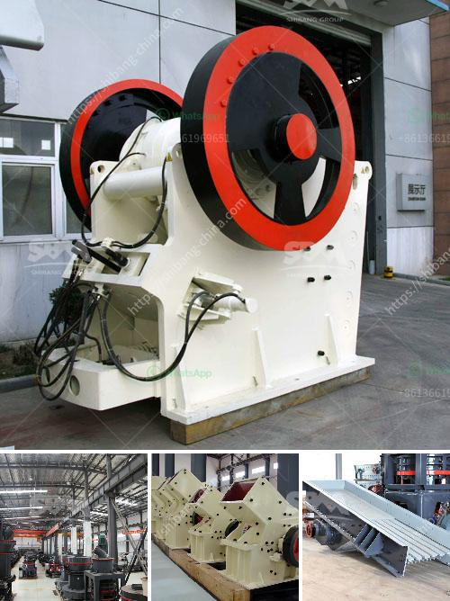

<h3>gypsum mining crusher in kenya manufacturer</h3>
Gypsum plays a very important role in the construction industry. It is the main ingredient in drywall, which is used to create walls and ceilings. Gypsum is also used as a filler in concrete and as a soil amendment for agricultural purposes.

In Kenya, gypsum mining is thriving with several local and international companies investing in the lucrative business. This mineral is extensively mined and processed mainly for exportation. However, the domestic market in Kenya is also growing due to the increased demand for construction materials.

One of the leading gypsum mining companies in Kenya is Apongo Mining. With over 25 years of experience in the industry, they have established themselves as a reliable manufacturer and supplier of high-quality gypsum products.

Apongo Mining operates several gypsum mines in different parts of the country. They have invested heavily in state-of-the-art equipment and machinery to ensure efficient mining operations. Their crushers are designed to crush the raw gypsum ore into smaller pieces that can be easily processed further.

The gypsum mining crusher used by Apongo Mining has a high production capacity and ensures consistent product quality. It has been specifically designed to meet the needs of the gypsum mining industry in Kenya. The crusher is able to crush different types of raw materials into desired sizes, which are then used for various purposes.

Apart from its efficiency, the crusher is also environmentally friendly. It is equipped with advanced dust suppression systems to minimize the release of dust and other air pollutants. This ensures a safe working environment for the employees and reduces the impact on the surrounding ecosystem.

Apongo Mining is committed to sustainable mining practices. They follow strict regulations and adhere to international standards to minimize their environmental footprint. They also support local communities by providing employment opportunities and investing in social development projects.

The gypsum products manufactured by Apongo Mining are of high quality and meet the international standards. They undergo rigorous testing to ensure that they meet the required specifications. This makes them suitable for a wide range of applications, including construction, agriculture, and industrial uses.

Apongo Mining exports a significant portion of their gypsum products to countries like India, China, and the Middle East. However, they also cater to the domestic market in Kenya. They supply gypsum products to construction companies, cement manufacturers, and farmers who use gypsum as a soil amendment.

In conclusion, gypsum mining plays a vital role in Kenya's construction industry. Apongo Mining is a leading manufacturer and supplier of high-quality gypsum products. Their efficient crushers and sustainable mining practices make them a reliable choice for customers in Kenya and abroad. With their commitment to quality and the environment, they are contributing to the growth and development of the gypsum mining sector in Kenya.
<h3>Contact us</h3><ul><li><strong>Whatsapp:&nbsp;<a href="https://wa.me/8613661969651">+8613661969651</a></strong></li><li><a href="https://swt.shibang-china.com/?git&amp;zhl&amp;gypsum mining crusher in kenya manufacturer"><strong>Online Service(chat now)</strong></a></li></ul><h3>Related</h3><ul><li><a href='3 roller mill and new zealand.md'>3 roller mill and new zealand</a></li><li><a href='sand washing screener florida.md'>sand washing screener florida</a></li><li><a href='quartz crusher machinery.md'>quartz crusher machinery</a></li><li><a href='best wash plant for gold mining.md'>best wash plant for gold mining</a></li><li><a href='stone crushing machine suppliers.md'>stone +crushing +machine +suppliers</a></li></ul>