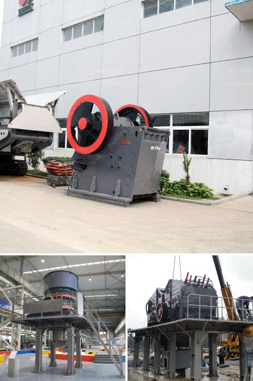

<h3>gypsum portland cement retarder manufacturer usa</h3>
Gypsum Portland Cement Retarder Manufacturer in the USA: Meeting the Growing Demand for Quality Construction Materials

The construction industry has witnessed immense growth and development over the years, creating a constant demand for high-quality and durable building materials. In this pursuit, gypsum portland cement retarder has emerged as a vital ingredient for construction, offering several advantages that enhance the performance and lifespan of various structures.

Gypsum portland cement retarder, also known as retarder for short, is a chemical additive incorporated in cement to control the setting time. It slows down the hydration process, allowing for greater workability and flexibility during construction. This, in turn, ensures the proper placement and installation of concrete, improving its overall strength and durability.

Addressing the need for reliable and efficient retarders, several manufacturers have stepped forward to cater to the growing demand. Among these manufacturers, the USA stands out as a leading player in the production of gypsum portland cement retarder, consistently delivering top-notch products that adhere to international quality standards.

One prominent gypsum portland cement retarder manufacturer in the USA is known for its commitment to providing the construction industry with superior products. With years of experience, this manufacturer has developed a reputation for excellence and reliability. Their expertise lies in producing retarders that not only extend the setting time of cement but also enhance its workability, improve its resistance to corrosion, and reduce the risk of cracks.

One of the unique aspects of this manufacturer is their rigorous quality control process. Every batch of gypsum portland cement retarder undergoes comprehensive testing to ensure consistency, reliability, and optimal performance. By adhering to the highest industry standards, this manufacturer guarantees that their products meet the requirements of various construction projects, regardless of their complexities.

Moreover, the gypsum portland cement retarders manufactured in the USA offer sustainable and eco-friendly characteristics. As an essential component of green construction practices, the retarders contribute to reducing the environmental impact of building projects. By using these retarders, construction companies can minimize waste, reduce energy consumption, and enhance the overall sustainability of their projects.

In addition to their commitment to quality and sustainability, the gypsum portland cement retarder manufacturer in the USA also provides customized solutions to meet specific project requirements. They work closely with clients to understand their needs, offer technical expertise, and develop tailor-made products. By prioritizing customer satisfaction, this manufacturer has built strong relationships with construction professionals and contractors throughout the country.

As the construction industry continues to grow and evolve, the demand for gypsum portland cement retarder in the USA is only expected to increase. With their expertise, commitment to quality, and sustainable practices, manufacturers in the USA are well-positioned to meet this growing demand while providing products that contribute to the longevity and durability of structures.

In conclusion, gypsum portland cement retarder plays a crucial role in the construction industry by enhancing the performance and durability of structures. The USA, with its leading manufacturers, has emerged as a reliable source of quality retarders that meet the highest industry standards. With their commitment to excellence, sustainability, and customizability, these manufacturers are empowering the construction industry to build better and more resilient structures.
<h3>Contact us</h3><ul><li><strong>Whatsapp:&nbsp;<a href="https://wa.me/8613661969651">+8613661969651</a></strong></li><li><a href="https://swt.shibang-china.com/?git&amp;zhl&amp;gypsum portland cement retarder manufacturer usa"><strong>Online Service(chat now)</strong></a></li></ul><h3>Related</h3><ul><li><a href='gold processing plant dry.md'>gold processing plant dry</a></li><li><a href='calcium carbonate factory costs.md'>calcium carbonate factory costs</a></li><li><a href='100tph stationery stone crushing plant.md'>100tph stationery stone crushing plant</a></li><li><a href='price of roller crusher.md'>price of roller crusher</a></li><li><a href='cost of tonne per day cement plant.md'>cost of tonne per day cement plant</a></li></ul>