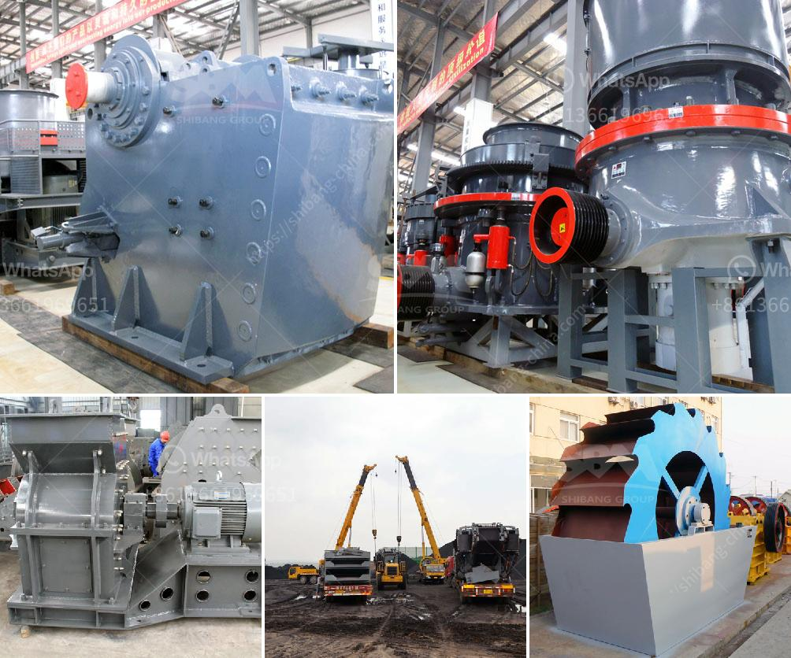

<h3>gypsum powder price in south africa</h3>
Gypsum is a mineral that is found in natural deposits all over the world. It is a common building material, used in various industries for its strength and versatility. Gypsum powder, also known as plaster of Paris, is gypsum that has been ground down into a fine powder. It has a wide range of applications, including as a construction material, in agriculture, and in the manufacturing of products like cement and plaster boards.

In South Africa, gypsum has been mined for decades. The country has vast reserves of this mineral, which are primarily found in the Gauteng, Mpumalanga, Limpopo, and North West provinces. South Africa is known for its high-quality gypsum, which is used in various industries both locally and internationally.

The price of gypsum powder in South Africa varies depending on the brand and quantity. Consumers can expect to pay anything from R100 to R300 per 40kg bag. The price can also be affected by factors such as location, availability, and any additional costs incurred during the manufacturing and distribution processes.

One of the main factors affecting the price of gypsum powder in South Africa is the demand and supply dynamics in the market. When the demand for gypsum powder is high, prices tend to rise. This can happen due to an increase in construction activity, agricultural needs, or manufacturing requirements. On the other hand, when demand is low, prices may decrease as suppliers try to stimulate demand and reduce excess stock.

Another factor that can influence the price of gypsum powder is the cost of production. This includes costs associated with mining, processing, transportation, and storage. Any increase in these costs can lead to a higher price for the end consumer. Additionally, fluctuations in the cost of raw materials and energy can also impact the price of gypsum powder.

The price of gypsum powder in South Africa can also be affected by international market trends. As a globally traded commodity, gypsum prices can be influenced by factors such as exchange rates, global demand and supply dynamics, and trade policies. For example, if there is a shortage of gypsum supply globally, prices may increase, affecting the local market as well.

It is essential for consumers to be aware of the factors that can affect the price of gypsum powder. This will allow them to make informed decisions when purchasing gypsum-based products. Factors to consider include the quality of the gypsum, the reputation of the supplier, and whether the price is justified based on market conditions.

In conclusion, the price of gypsum powder in South Africa can vary depending on various factors such as demand and supply dynamics, production costs, and international market trends. While the price range for a 40kg bag can range from R100 to R300, it is crucial for consumers to consider the quality and reputation of the supplier when making a purchase decision. Additionally, individuals should stay informed about market conditions and trends that can impact gypsum prices, allowing them to make informed choices and ensure they receive value for their money.
<h3>Contact us</h3><ul><li><strong>Whatsapp:&nbsp;<a href="https://wa.me/8613661969651">+8613661969651</a></strong></li><li><a href="https://swt.shibang-china.com/?git&amp;zhl&amp;gypsum powder price in south africa"><strong>Online Service(chat now)</strong></a></li></ul><h3>Related</h3><ul><li><a href='barite rock mill.md'>barite rock mill</a></li><li><a href='vertical roller pre grinding mill.md'>vertical roller pre grinding mill</a></li><li><a href='jaw crusher with production capacity of 80 100 ton hr.md'>jaw crusher with production capacity of 80 100 ton hr</a></li><li><a href='rubble recycle concrete crusher hire.md'>rubble recycle concrete crusher hire</a></li><li><a href='limestone crusher india.md'>limestone crusher india</a></li></ul>