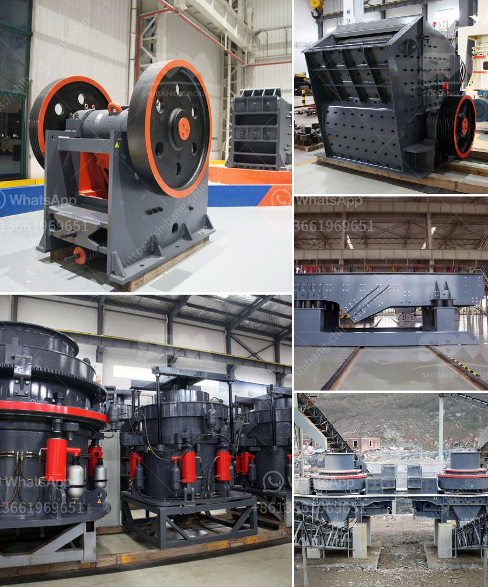

<h3>gypsum processing line</h3>
Gypsum, a naturally occurring mineral, is widely used in various industries for its diverse range of applications. One of the primary uses of gypsum is in the construction industry, where it is utilized to produce plasters, drywall, and cement. To meet the growing demand for gypsum products, a well-structured gypsum processing line becomes crucial.

A typical gypsum processing line starts with the extraction and transportation of gypsum ore from quarries or mines. The ore is then crushed into smaller pieces and heated to remove any excess water content. This process, known as calcination, transforms the raw material into a fine powder called gypsum.

Next, the powdered gypsum is mixed with water to form a slurry. The slurry is then poured into molds or boards where it is left to solidify and dry. These dried gypsum boards are commonly known as drywall or plasterboard and are widely used in the construction of walls and ceilings.

Apart from drywall production, the gypsum processing line also caters to other industries such as agriculture and cement manufacturing. In agriculture, powdered gypsum is utilized to improve soil structure and fertility. It helps to break up compacted soil and provides essential nutrients like calcium and sulfur to the plants.

In cement manufacturing, gypsum is used as a raw material to control the setting time of cement. By adding finely ground gypsum to the cement, manufacturers can regulate the hydration process, ensuring quality and durability of the final product.

Overall, a well-designed gypsum processing line plays a vital role in meeting the demands of various industries. By efficiently extracting, processing, and utilizing gypsum, we can harness its multiple benefits while contributing to sustainable development.
<h3>Contact us</h3><ul><li><strong>Whatsapp:&nbsp;<a href="https://wa.me/8613661969651">+8613661969651</a></strong></li><li><a href="https://swt.shibang-china.com/?git&amp;zhl&amp;gypsum processing line"><strong>Online Service(chat now)</strong></a></li></ul><h3>Related</h3><ul><li><a href='grinding roller mill machine.md'>grinding roller mill machine</a></li><li><a href='company in japan dealing in portable crusher machine.md'>company in japan dealing in portable crusher machine</a></li><li><a href='dolomite grinding machines suppliers in india.md'>dolomite grinding machines suppliers in india</a></li><li><a href='magnesite mining analysis south africa.md'>magnesite mining analysis south africa</a></li><li><a href='crusher near sale saudi arabia.md'>crusher near sale saudi arabia</a></li></ul>