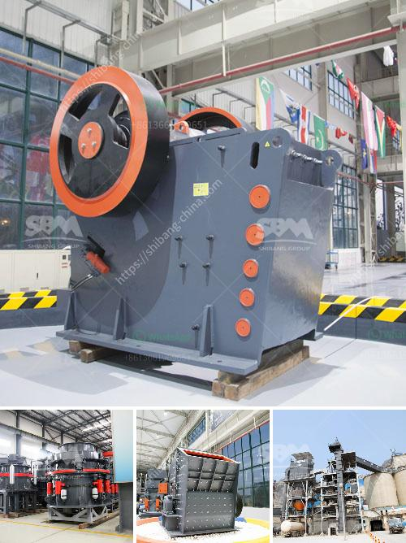

<h3>gypsum production machinery</h3>
The construction industry, with its ever-increasing demand for housing and infrastructure developments, heavily relies on gypsum as a primary material. Gypsum, a soft sulfate mineral, is used in various construction applications due to its fire-resistance, sound insulation, and mold-resistant properties. To meet the growing demand, manufacturers utilize advanced gypsum production machinery that enables efficient processing and high-quality gypsum products.

Gypsum production machinery plays a crucial role in the gypsum manufacturing process. Among the key components of machinery utilized in the production line are raw ore, feeders, crushers, conveyors, calciners, storage tanks, and packing systems. Raw ore, obtained through mining or quarries, is first crushed and screened to size before being fed into the production machinery.

Feeders are responsible for evenly distributing the crushed gypsum to crushers, ensuring a continuous flow into the production line. Crushers, available in various types and sizes, reduce the raw ore to smaller particles, making it easier for subsequent processing. Conveyors transport the crushed gypsum throughout the production line, efficiently moving the material between different stages.

Calcination, a critical step in the production process, is achieved through specialized machinery known as calciners. The main purpose of calciners is to heat the crushed gypsum to temperatures that drive off excess water and convert it into the desired form of gypsum, known as hemihydrate or plaster of Paris. The calcined gypsum is further processed to control the particle size, moisture content, and other properties.

Storage tanks are utilized to store the processed gypsum slurry, ensuring a consistent supply for subsequent stages of production. These tanks require precise engineering to maintain appropriate levels of moisture and ensure the product remains fresh and workable. Reliable and efficient storage systems play a vital role in maximizing production efficiency and minimizing material waste.

Packing systems are the final stage in gypsum production machinery, allowing the finished products to be packaged and prepared for distribution. These systems ensure accurate weighing, proper sealing, and efficient handling of the packaged gypsum, whether it be in bags, containers, or bulk shipments.

Manufacturers of gypsum production machinery continually invest in research and development to improve their equipment, aiming to enhance production efficiency, reduce energy consumption, and mitigate environmental impacts. Advanced automation and control systems are incorporated into machinery to optimize operations, monitor process parameters, and minimize downtime.

Apart from traditional machinery, new innovative technologies are emerging in the gypsum production industry. For instance, equipment utilizing fluidized bed technology provides efficient calcination and allows precise control over the gypsum's physical properties. Additionally, continuous manufacturing processes with high-speed production lines have been introduced, enabling faster and more streamlined gypsum production.

In conclusion, gypsum production machinery plays a crucial role in meeting the construction industry's escalating demand for high-quality gypsum products. From raw ore to finished goods, these machines facilitate efficient processing, ensuring the gypsum conforms to the necessary standards for fire resistance, sound insulation, and mold prevention. Manufacturers continue to invest in innovative technologies and automation, aiming to improve production efficiency and reduce environmental impact. With the continuous advancements in gypsum production machinery, the construction industry can confidently rely on a consistent supply of gypsum for its diverse application needs.
<h3>Contact us</h3><ul><li><strong>Whatsapp:&nbsp;<a href="https://wa.me/8613661969651">+8613661969651</a></strong></li><li><a href="https://swt.shibang-china.com/?git&amp;zhl&amp;gypsum production machinery"><strong>Online Service(chat now)</strong></a></li></ul><h3>Related</h3><ul><li><a href='ball mill nigeria.md'>ball mill nigeria</a></li><li><a href='rock crushing equipment for sale.md'>rock crushing equipment for sale</a></li><li><a href='sand washing machines turkey.md'>sand washing machines turkey</a></li><li><a href='brick factory for sale in uk.md'>brick factory for sale in uk</a></li><li><a href='talc powder production.md'>talc powder production</a></li></ul>