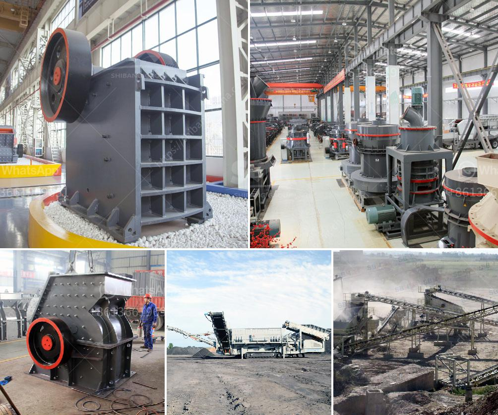

<h3>gypsum recycling plant cost</h3>
Gypsum, also known as calcium sulfate dihydrate, is a widely-used material in the construction industry. It is primarily used in the production of drywall, plaster, and cement. However, the disposal of gypsum waste poses a significant environmental challenge. Fortunately, gypsum recycling plants have emerged as a sustainable solution for dealing with this waste material. In this article, we will explore the cost of setting up a gypsum recycling plant.

The cost of establishing a gypsum recycling plant can vary widely depending on several factors. The scale of the plant, the quality of equipment used, and the location are some essential aspects to consider. However, it is generally understood that the initial investment required for setting up a gypsum recycling plant can be significant.

One of the critical components in a gypsum recycling plant is the shredder. The shredder plays a crucial role in breaking down the gypsum waste into smaller pieces that can be processed further. The cost of a reliable and efficient shredder can range from $100,000 to $500,000, depending on the size and capacity required. This initial investment in a high-quality shredder is crucial for the overall success of the plant.

Besides the shredder, other equipment required for a gypsum recycling plant includes crushers, screens, magnets, and conveyors. The cost of this additional equipment can vary based on the plant's capacity and specific requirements. These costs can range from $200,000 to $1,000,000, depending on the size and complexity of the plant.

Another significant cost to consider is the storage and transportation of the recycled gypsum. Adequate storage facilities are necessary to ensure that the recycled gypsum can be stored safely until it can be transported to end-users. The cost of storage facilities depends on factors such as the amount of recycled gypsum produced and the plant's location. Transportation costs can also vary depending on the distance to the end-users.

In addition to the initial costs of setting up a gypsum recycling plant, operational costs should also be considered. These costs include maintenance, labor, electricity, and other utility expenses. The precise operational costs will vary depending on the plant's size, production capacity, and efficiency. However, it is essential to note that these operational costs can be offset by the revenue generated from selling the recycled gypsum.

It is worth highlighting that the cost of setting up a gypsum recycling plant may seem high initially. However, it is crucial to consider the long-term benefits and savings that can be achieved through recycling. By recycling gypsum waste instead of sending it to landfill, significant environmental benefits can be realized. These include reduced waste generation, decreased greenhouse gas emissions, and conservation of natural resources.

Furthermore, recycled gypsum can be sold for various applications, such as agricultural uses, as a soil amendment, or for the production of new gypsum-based products. This revenue from selling the recycled gypsum can contribute to offsetting the initial investment and operational costs of the plant.

In conclusion, although the cost of setting up a gypsum recycling plant can be significant, it is a sustainable solution that brings numerous environmental benefits. The initial investment in equipment, storage, and transportation facilities is crucial for the successful operation of the plant. Despite these costs, the long-term savings and revenue generated from selling recycled gypsum make it a worthwhile venture. Ultimately, a gypsum recycling plant provides an opportunity to contribute to a circular economy by reducing waste and creating a more sustainable construction industry.
<h3>Contact us</h3><ul><li><strong>Whatsapp:&nbsp;<a href="https://wa.me/8613661969651">+8613661969651</a></strong></li><li><a href="https://swt.shibang-china.com/?git&amp;zhl&amp;gypsum recycling plant cost"><strong>Online Service(chat now)</strong></a></li></ul><h3>Related</h3><ul><li><a href='coal processing plant maintenance.md'>coal processing plant maintenance</a></li><li><a href='cement grinding plant layout.md'>cement grinding plant layout</a></li><li><a href='how much is mobile crusher rock.md'>how much is mobile crusher rock</a></li><li><a href='how to machine limestone.md'>how to machine limestone</a></li><li><a href='small jaw crusher for sale.md'>small jaw crusher for sale</a></li></ul>