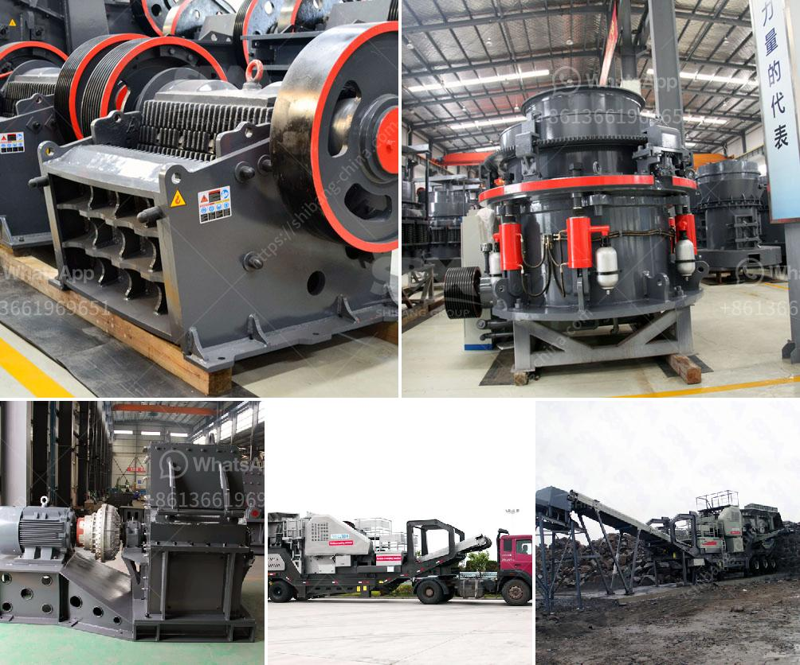

<h3>gypsum washing plant</h3>
Gypsum is an abundant mineral that has been widely used in construction and agricultural applications for centuries. With the increasing demand for gypsum products, it is essential to find efficient ways to extract and process the mineral. Gypsum washing plant is one solution that can help to remove gypsum impurities and achieve a higher quality product.

Gypsum washing plant may be a standalone unit or integrated into a larger system, typically used to classify and dewater gypsum particles in a slurry. Often sold as a by-product, gypsum is an essential mineral in several industries, including construction, agriculture, and pharmaceuticals. Therefore, it is crucial to process the gypsum to remove any impurities and ensure its quality before it can be used in various applications.

The primary purpose of a gypsum washing plant is to remove impurities such as clay, silt, and other unwanted materials from the gypsum ore to create a high-quality product suitable for further processing and usage. The process typically begins with the gypsum ore being excavated from mines or quarries and then transported to the washing plant. At the plant, the gypsum ore is crushed, screened, and washed to remove any impurities.

The washing process involves several steps, including screening the gypsum ore to separate it into different sizes, agitation in water to remove clay and other impurities, and finally, dewatering to achieve the desired moisture content. The use of water and specialized equipment such as hydrocyclones, attrition scrubbers, and dewatering screens play a crucial role in effectively washing the gypsum.

Washing aids, such as flocculants and surfactants, are often used to enhance the washing process by promoting the settlement of suspended solids and improving the separation of impurities. These chemicals help to maximize the removal of clay, silt, and other contaminants, ensuring a cleaner and higher quality gypsum product.

By utilizing a gypsum washing plant, businesses can produce a consistent and high-quality gypsum product that meets the specific requirements of their customers. Whether it is used as a construction material or as a soil conditioner in agriculture, the purity and quality of gypsum play a vital role in its effectiveness.

Furthermore, a gypsum washing plant can also help to minimize environmental impacts. The removal of impurities from the gypsum ore reduces the need for additional processing steps in downstream operations. Additionally, the use of water in the washing process can be optimized through recycling and reducing water consumption, which contributes to sustainable water management practices.

In conclusion, a gypsum washing plant is a crucial component in the processing of gypsum ore, allowing businesses to produce a high-quality product while minimizing environmental impacts. By effectively removing impurities, businesses can ensure the consistency and purity of their gypsum, enabling its use in various applications across different industries.
<h3>Contact us</h3><ul><li><strong>Whatsapp:&nbsp;<a href="https://wa.me/8613661969651">+8613661969651</a></strong></li><li><a href="https://swt.shibang-china.com/?git&amp;zhl&amp;gypsum washing plant"><strong>Online Service(chat now)</strong></a></li></ul><h3>Related</h3><ul><li><a href='stone crusher machine in russia.md'>stone crusher machine in russia</a></li><li><a href='iron ore processing equipment.md'>iron ore processing equipment</a></li><li><a href='manufacturing from quatrz powder.md'>manufacturing from quatrz powder</a></li><li><a href='stone crusher machine manufacturer germany.md'>stone crusher machine manufacturer germany</a></li><li><a href='coal transfer conveyor supplier in china.md'>coal transfer conveyor supplier in china</a></li></ul>