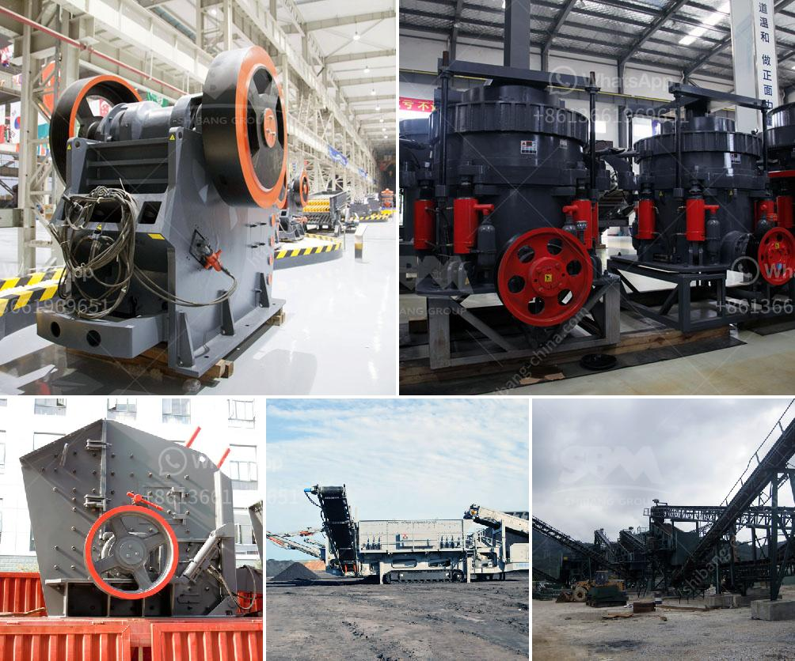

<h3>gyratory crusher price</h3>
The gyratory crusher market is witnessing steady growth with the rise in demand for minerals and metals across various industries. Gyratory crushers are extensively used in the mining industry for primary crushing purposes. However, the high upfront cost of these crushers often discourages many mining companies and contractors from investing in them.

One of the key factors influencing the price of gyratory crushers is the technical specifications. Large and powerful machines require more materials and manufacturing processes, leading to higher costs. Additionally, the size and capacity of the crusher also play a crucial role in determining the price.

Another factor impacting the gyratory crusher price is the market competition. Several manufacturers offer similar crushers, giving buyers a wide range of options to choose from. As a result, the market forces of supply and demand come into play, affecting the pricing strategy of manufacturers. Companies may lower the prices to gain a competitive edge or increase the pricing if their product offers unique features or superior performance.

The level of automation and technology integration in gyratory crushers is yet another price determinant. Advanced features like automated control systems, remote monitoring, and real-time diagnostics can significantly enhance the efficiency and productivity of the crusher. However, these advancements come at an additional cost, resulting in higher-priced crushers.

Another influential factor is the cost of raw materials used in the manufacturing process. Fluctuations in the prices of raw materials such as steel, iron, and aluminum can directly impact the production cost of gyratory crushers. Consequently, manufacturers might adjust the prices accordingly to maintain profit margins.

Furthermore, factors like transportation costs, import and export duties, and government regulations also play a role in the overall gyratory crusher price. For instance, crushers manufactured in countries with low labor and production costs might be relatively cheaper than those produced in high-cost regions.

Considering the range of factors that influence the gyratory crusher price, it is essential to analyze the specific requirements of each project. By evaluating the desired technical specifications, capacity needs, and budget constraints, mining companies and contractors can make informed decisions about purchasing gyratory crushers that align with their goals.
<h3>Contact us</h3><ul><li><strong>Whatsapp:&nbsp;<a href="https://wa.me/8613661969651">+8613661969651</a></strong></li><li><a href="https://swt.shibang-china.com/?git&amp;zhl&amp;gyratory crusher price"><strong>Online Service(chat now)</strong></a></li></ul><h3>Related</h3><ul><li><a href='mini cone crusher price used.md'>mini cone crusher price used</a></li><li><a href='stone crushers plant prices.md'>stone crushers plant prices</a></li><li><a href='crussher stone manufacturer in south africa.md'>crussher stone manufacturer in south africa</a></li><li><a href='how to make silica rock pebles in ball mill.md'>how to make silica rock pebles in ball mill</a></li><li><a href='turkey plant production line of gypsum powder.md'>turkey plant production line of gypsum powder</a></li></ul>