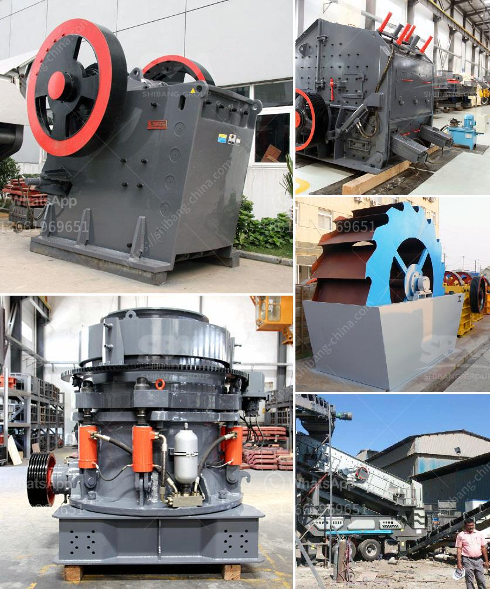

<h3>hammer crusher pc400</h3>
The hammer crusher PC400 is a highly advanced stone crushing machine that combines both domestic and foreign crushing technology. Backed by our constant technical innovation, this crusher is ideal for crushing materials with a diameter of 100-500mm. Its crushing capacity ranges from 5 to 1000 tons per hour, making it suitable for both small and large-scale operations. Let's delve into the features and benefits of this powerful tool.

The PC400 hammer crusher offers a wide range of applications in various industries such as mining, cement, construction, metallurgy, and chemical. Its rugged design ensures reliable operation, even under harsh conditions. Our engineers have carefully optimized the crushing chamber and rotor structure, resulting in improved efficiency and reduced power consumption.

One of the standout features of the PC400 is its adjustable discharge size. The crusher allows users to adjust the gap between the hammer and the counter plates, enabling precise control over the final product size. This flexibility makes it suitable for producing different grades of crushed materials, meeting various project requirements.

Furthermore, the PC400 is equipped with a high-speed rotating rotor that utilizes the kinetic energy of the hammer to impact the material. This powerful impact force facilitates efficient and uniform crushing, reducing the production of excessive fines. The advanced crushing chamber design also minimizes the risk of clogging, ensuring uninterrupted operation and higher productivity.

In terms of maintenance, the PC400 offers easy access for inspection and servicing. The hinged housing provides effortless access to the hammer and counter plates, allowing for quick replacement. Additionally, the crusher's durable wear-resistant components help to prolong its lifespan, minimizing downtime and reducing overall operating costs.

To ensure safety during operation, the PC400 is equipped with various protective measures. The crusher is fitted with a safety system that automatically stops the motor in case of overload or blockage. Furthermore, the unique design of the housing and feed hopper prevents human contact with moving parts, minimizing the risk of accidents.

In conclusion, the PC400 hammer crusher is a highly efficient and versatile crushing machine. Its innovative design allows for easy adjustment of the discharge size, meeting the specific requirements of each project. With its robust construction and reliable performance, this crusher is the perfect choice for both small and large-scale operations. Whether you are in the construction, mining, or cement industry, the PC400 offers a cost-effective solution for all your crushing needs.
<h3>Contact us</h3><ul><li><strong>Whatsapp:&nbsp;<a href="https://wa.me/8613661969651">+8613661969651</a></strong></li><li><a href="https://swt.shibang-china.com/?git&amp;zhl&amp;hammer crusher pc400"><strong>Online Service(chat now)</strong></a></li></ul><h3>Related</h3><ul><li><a href='crushing plant in maule.md'>crushing plant in maule</a></li><li><a href='conveyor belts enginners in south africa.md'>conveyor belts enginners in south africa</a></li><li><a href='iron slag crusher india.md'>iron slag crusher india</a></li><li><a href='buy ultra fine grinder mill.md'>buy ultra fine grinder mill</a></li><li><a href='crushing plant assembly.md'>crushing plant assembly</a></li></ul>