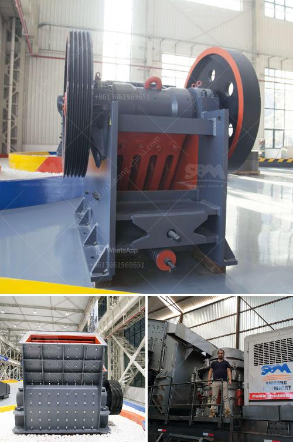

<h3>hammer crushers price</h3>
Hammer crusher is an important machine in mining machinery industry and widely used in cement, building materials, chemical industry, electric power, mining, metallurgy and other industries. The hammer crusher has the characteristic of large feeding size, high crushing ratio, low cost of investment and convenient maintenance. Therefore, the price of hammer crushers is generally higher than professional crushers.

However, the price of hammer crushers is relatively cheap compared with other crushers, because of its wide range of applications and low cost, making it a trusted choice for many stone production lines.

Today, I will introduce to you the hammer crusher price list by Fote, a Chinese manufacturer with 40 years of experience.

Hammer crusher price depends on the specific model, brand and manufacturer, as well as the production costs of the equipment itself. The level of price fluctuation varies according to market demand. With the booming mining industry, the demand for hammer crusher has been increasing greatly.

Hammer crusher, also known as hammer mill crusher, is a type of crushing machine that is driven by hammerhead, pounding materials by high-speed hammering. It is suitable for crushing brittle materials with medium-hardness, such as limestone, coal, and others.

Brand is an important factor that influences the price. Different brands of stone crusher hammer have varied price. The price is mainly influenced by the following factors:

Brand: The brand is the most important factor affecting the price. Different brands have different prices due to their quality, appearance, and technology.

The production cost of hammer crusher has a great impact on the market quotation. In general, there are two types of costs involved in the production of hammer crusher:

1) Direct material cost: the direct material cost includes the raw materials used in the production process of the equipment. In addition, hammer crushers also need to carry out professional maintenance and repair.

2) Direct labor cost: direct labor refers to the operators who handle hammer crusher in the production process. There are professional maintenance personnel in the factory to guide the use and operation of hammer crushers.

As the market demand for hammer crushers gradually increases, the price of hammer crushers will also gradually rise. Therefore, the price of hammer crushers will rise with the trend of the market demand.

In conclusion, hammer crusher price is influenced by the specific model, brand and manufacturer, as well as the production cost of the equipment itself. The fluctuation of the price depends on the market demand and factors mentioned above. As for the specific price, you can consult professionals with more than 40 years of industry experience at Fote. They will provide you with the most suitable and resonable hammer crusher price, saving you more investment costs!
<h3>Contact us</h3><ul><li><strong>Whatsapp:&nbsp;<a href="https://wa.me/8613661969651">+8613661969651</a></strong></li><li><a href="https://swt.shibang-china.com/?git&amp;zhl&amp;hammer crushers price"><strong>Online Service(chat now)</strong></a></li></ul><h3>Related</h3><ul><li><a href='jaw crusher pe 150x250.md'>jaw crusher pe 150x250</a></li><li><a href='crushers for sale in.md'>crushers for sale in</a></li><li><a href='gold milling plant cost.md'>gold milling plant cost</a></li><li><a href='talc powder production.md'>talc powder production</a></li><li><a href='manufacturing process of talcum powder.md'>manufacturing process of talcum powder</a></li></ul>