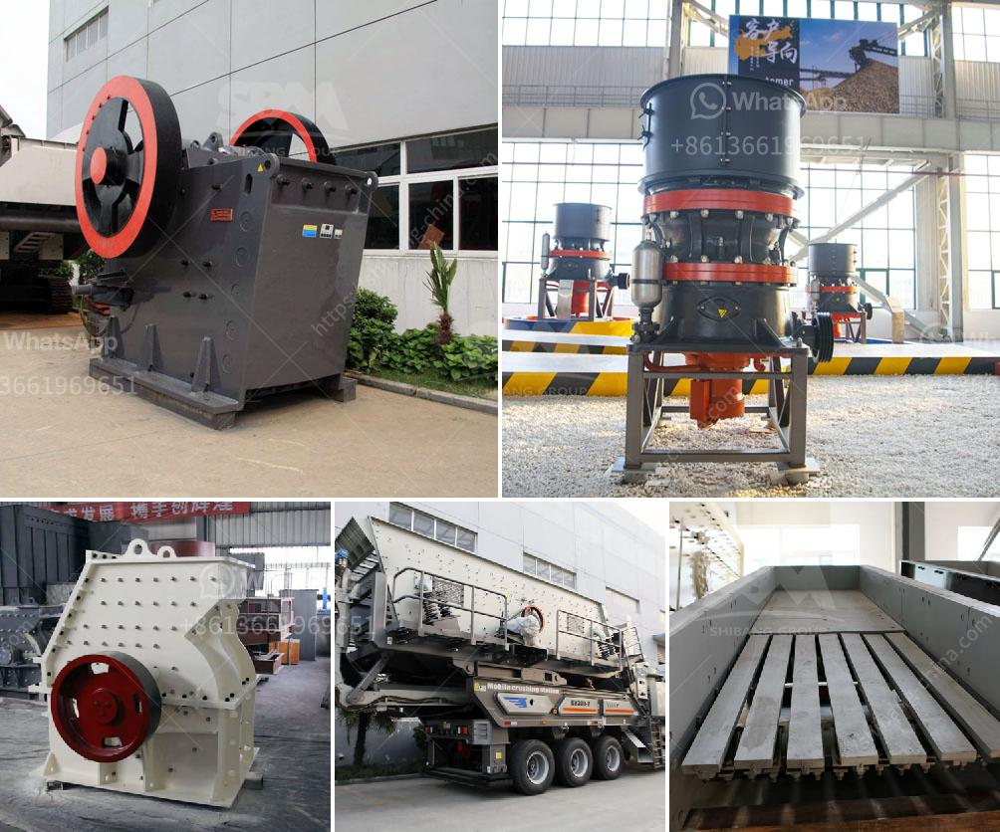

<h3>hammer mill clays price</h3>
When it comes to the production of quality ceramics, the raw materials used play a vital role in determining the overall outcome. Clays, in particular, are one of the primary ingredients used in the ceramic industry. They are versatile and offer various properties that make them suitable for different types of products. However, the cost of clays, specifically those processed using hammer mills, is a crucial factor that manufacturers need to consider.

Hammer mill clays, also known as kaolin clays, are widely used in the ceramics industry due to their exceptional qualities. These clays are known for their fine particle size, which allows for better plasticity and workability during shaping and forming processes. Additionally, they exhibit excellent bonding and firing properties, resulting in ceramics with improved strength, durability, and heat resistance.

One of the critical factors that impact the price of hammer mill clays is the quality of the material. Clays with higher purity levels and lower impurities tend to have a higher price tag. The purity of the clays is crucial as any impurities, such as iron oxide or organic matter, can negatively affect the final ceramic product's quality. Therefore, manufacturers often invest in higher quality clays to ensure the best results and enhance their product offerings.

Another aspect that determines the price of hammer mill clays is the geographical location of the clay deposits. Clays found in specific regions might have unique characteristics and properties, making them more desirable in certain industries. For example, clays found in certain regions may have a higher plasticity, making them ideal for pottery making. Conversely, clays found in other areas may have lower plasticity but offer superior firing properties, making them preferred for porcelain production. The availability and transportation costs associated with sourcing clays from different regions can also affect their price.

The demand and supply dynamics in the ceramic industry also impact the price of hammer mill clays. As with any commoditized product, the price of clays can fluctuate based on market conditions. Increases in demand often lead to higher prices, while oversupply can result in reduced prices. Manufacturers must closely monitor market trends and adjust their pricing strategies accordingly to remain competitive and meet customer demands.

Apart from these external factors, the cost of processing and refinement also affects the final price of hammer mill clays. The use of hammer mills in grinding and pulverizing the clays requires specialized equipment, machinery, and energy consumption. These costs are often factored into the selling price of the clays. Additionally, the process of refining the clays to achieve the desired particle size and quality also adds to the overall cost.

In conclusion, the price of hammer mill clays is a critical consideration for ceramic manufacturers. The quality of the clays, their geographical location, the dynamics of supply and demand, and the cost of processing and refinement are all factors that influence their pricing. By carefully evaluating these factors and making informed decisions, manufacturers can ensure they source and utilize the best clays at an optimal price point. This, in turn, will help them produce high-quality ceramics that meet customer expectations and stay competitive in the industry.
<h3>Contact us</h3><ul><li><strong>Whatsapp:&nbsp;<a href="https://wa.me/8613661969651">+8613661969651</a></strong></li><li><a href="https://swt.shibang-china.com/?git&amp;zhl&amp;hammer mill clays price"><strong>Online Service(chat now)</strong></a></li></ul><h3>Related</h3><ul><li><a href='machines used in sand and gravel quarry philippines.md'>machines used in sand and gravel quarry philippines</a></li><li><a href='sand crushing equipment sale in tanzania.md'>sand crushing equipment sale in tanzania</a></li><li><a href='kenya quarry crusher.md'>kenya quarry crusher</a></li><li><a href='widely used small stone jaw crusher crusher.md'>widely used small stone jaw crusher crusher</a></li><li><a href='chinese stone crusher machine.md'>chinese stone crusher machine</a></li></ul>