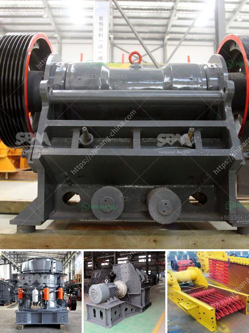

<h3>hammer mill dimension</h3>
A hammer mill is a versatile machine used in the pharmaceutical, chemical, food, and beverage industries. It is also commonly used in the agricultural sector for animal feed production. In this article, we will focus on the dimensions of a hammer mill.

The size, shape, and dimensions of a hammer mill are determined by several factors, including the intended application, the rotational speed of the mill, and the size of the incoming material. Hammer mills come in various sizes, ranging from small laboratory models that fit on a tabletop to large industrial units used in heavy-duty applications.

A typical hammer mill consists of a horizontal rotor assembly that operates at high speed. The hammers attached to the rotor strike the materials as they pass through the grinding chamber, reducing their size. The screen located at the bottom of the grinding chamber determines the particle size of the final product. By changing the size of the screen, various particle sizes can be obtained.

Hammer mill dimensions vary based on the capacity and requirements of the specific application. For small-scale operations, a hammer mill with a compact design and minimal footprint is suitable. These models typically have a smaller rotor diameter and shorter grinding chamber length. They also have lower power requirements.

On the other hand, industrial-grade hammer mills used for large-scale operations have larger dimensions. They feature a higher capacity and are capable of processing a greater volume of material in a shorter time. These models have a larger rotor diameter, longer grinding chamber length, and more hammers. They require higher power input due to their increased size and processing capabilities.

In conclusion, the dimensions of a hammer mill depend on various factors such as the intended application, material characteristics, and desired capacity. Choosing the right size of a hammer mill is crucial for efficient and effective milling operations. It is important to consult with experts or manufacturers to determine the ideal dimensions that would best suit your specific requirements.
<h3>Contact us</h3><ul><li><strong>Whatsapp:&nbsp;<a href="https://wa.me/8613661969651">+8613661969651</a></strong></li><li><a href="https://swt.shibang-china.com/?git&amp;zhl&amp;hammer mill dimension"><strong>Online Service(chat now)</strong></a></li></ul><h3>Related</h3><ul><li><a href='ball mill supplier in pune.md'>ball mill supplier in pune</a></li><li><a href='prices of iron ore crushers.md'>prices of iron ore crushers</a></li><li><a href='feasibility study for stone crusher plants.md'>feasibility study for stone crusher plants</a></li><li><a href='best machine for marble processing.md'>best machine for marble processing</a></li><li><a href='parts for stone crushers.md'>parts for stone crushers</a></li></ul>