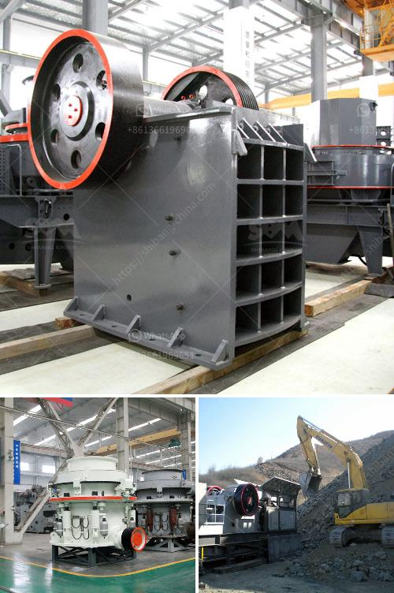

<h3>hammer mill indutrial price malaysia</h3>
In Malaysia's industrial sector, various machines play a crucial role in ensuring efficient operations and enhanced productivity. One such machine is the hammer mill, known for its versatility and high performance. With an array of benefits, the hammer mill has become an indispensable equipment for numerous industries.

The hammer mill is a robust machine that is designed to crush and shred materials into smaller pieces. Its simple yet efficient mechanism consists of a rotating shaft with free-swinging hammers, which impact and reduce the size of the materials. This makes it ideal for a wide range of applications, including grinding grains, crushing coal, and recycling waste.

One significant advantage of the hammer mill is its adaptability to different materials. It can process anything from wood and biomass to minerals and chemicals. This flexibility allows industries to achieve their desired particle size, whether it is for animal feed, biofuel production, or manufacturing processes.

Moreover, hammer mills in Malaysia are highly durable and require minimal maintenance. They are built to withstand heavy-duty usage, ensuring a longer lifespan and reduced downtime. This means businesses can rely on them for continuous and uninterrupted production.

Another crucial factor in the popularity of hammer mills is their cost-effectiveness. Compared to other grinding machines, hammer mills offer a more cost-efficient solution. They require less energy consumption and have lower operating costs, making them an excellent investment for businesses of all sizes.

When it comes to purchasing a hammer mill in Malaysia, there are several factors to consider. The industrial price may vary depending on the machine's capacity, power, and additional features. It is essential for businesses to evaluate their specific needs and select the appropriate model that aligns with their requirements and budget.

Fortunately, Malaysia offers various options for procuring hammer mills. Specialized suppliers and manufacturers cater to the diverse demands of different industries. These providers offer competitive prices, ensuring that businesses can acquire high-quality hammer mills at reasonable rates.

In conclusion, the hammer mill has become an indispensable tool in Malaysia's industrial landscape. Its versatility, durability, and cost-effectiveness make it an ideal choice for enhancing efficiency and productivity. With the right hammer mill, businesses can streamline their operations and achieve optimal results, further contributing to Malaysia's industrial growth.
<h3>Contact us</h3><ul><li><strong>Whatsapp:&nbsp;<a href="https://wa.me/8613661969651">+8613661969651</a></strong></li><li><a href="https://swt.shibang-china.com/?git&amp;zhl&amp;hammer mill indutrial price malaysia"><strong>Online Service(chat now)</strong></a></li></ul><h3>Related</h3><ul><li><a href='used stone crusher for sale in dubai.md'>used stone crusher for sale in dubai</a></li><li><a href='quartz stone powder mill.md'>quartz stone powder mill</a></li><li><a href='sand and gravel dryer equipment qatar.md'>sand and gravel dryer equipment qatar</a></li><li><a href='calcite processing equipment.md'>calcite processing equipment</a></li><li><a href='calcium carbonate proses by process.md'>calcium carbonate proses by process</a></li></ul>