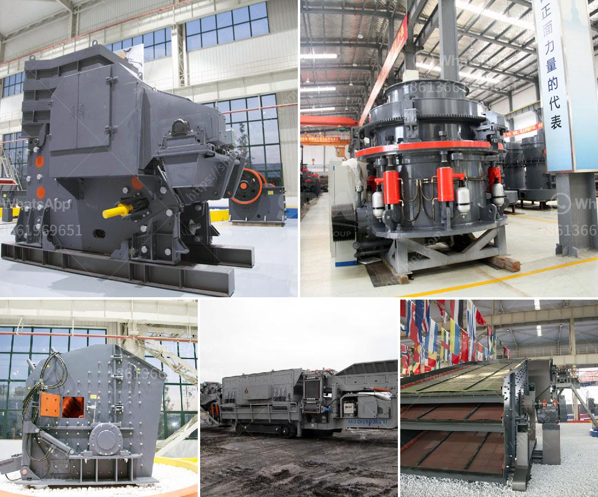

<h3>hammer mill machine buy</h3>
The hammer mill machine is a necessary equipment in agricultural and biomass industries. It can be used for grinding crops and residues into smaller pieces or powder for livestock feed and organic fertilizer production. With the adoption of advanced technology, the hammer mill machine is widely used in many industrial sectors.

The machine has a high production capacity, low energy consumption, and low investment cost. It is especially suitable for small or medium-sized farming and livestock raising businesses. The hammer mill machine has multiple functions, including crushing, grinding, and separating. It can process different raw materials for varied purposes.

1. Durability: The machine is made of high-quality materials, ensuring its long service life and stable performance even under heavy workload. It is designed to withstand the wear and tear caused by continuous operation.

2. Versatility: The hammer mill machine can handle a wide range of materials, including grains, straw, grasses, sawdust, and wood chips. It can be used for both dry and wet grinding, making it suitable for various applications.

3. Efficiency: The machine is equipped with a powerful motor and rotating hammers that deliver high-speed impacts to the material. This ensures efficient grinding and crushing, resulting in finer and more consistent output.

4. Easy operation: The hammer mill machine is user-friendly, with simple controls and easy maintenance. It can be operated by unskilled workers, saving labor costs. The machine also comes with safety features to protect the operator from potential hazards.

5. Affordable price: Compared to other grinding equipment, the hammer mill machine is relatively affordable, making it an ideal choice for small-scale farmers and entrepreneurs. Its cost-effectiveness and high performance make it a smart investment for any business.

1. Capacity: Determine the required production capacity based on your business needs. Different models of hammer mill machines have different processing capacities.

2. Power: Consider the power source available in your region. The hammer mill machine can be electrically or diesel-powered, depending on your preference and availability of energy sources.

3. Quality and reliability: Choose a reputable manufacturer or supplier that offers reliable and high-quality machines. Ensure that spare parts are readily available to minimize downtime.

4. After-sales service: Check if the manufacturer provides comprehensive after-sales support, including maintenance, repairs, and technical assistance.

In conclusion, the hammer mill machine is a versatile and efficient machine that serves as a perfect solution for grinding and crushing various materials. Its high production capacity, low energy consumption, and affordable price make it a popular choice among farmers, entrepreneurs, and industrial sectors. When purchasing a hammer mill machine, consider factors such as capacity, power, quality, and after-sales service to ensure a wise investment.
<h3>Contact us</h3><ul><li><strong>Whatsapp:&nbsp;<a href="https://wa.me/8613661969651">+8613661969651</a></strong></li><li><a href="https://swt.shibang-china.com/?git&amp;zhl&amp;hammer mill machine buy"><strong>Online Service(chat now)</strong></a></li></ul><h3>Related</h3><ul><li><a href='mobile stone crusher price india.md'>mobile stone crusher price india</a></li><li><a href='gypsum board plant initial investment.md'>gypsum board plant initial investment</a></li><li><a href='hammer mill machine buy.md'>hammer mill machine buy</a></li><li><a href='rubble crushing machine.md'>rubble crushing machine</a></li><li><a href='calcium carbonate crushing machine.md'>calcium carbonate crushing machine</a></li></ul>