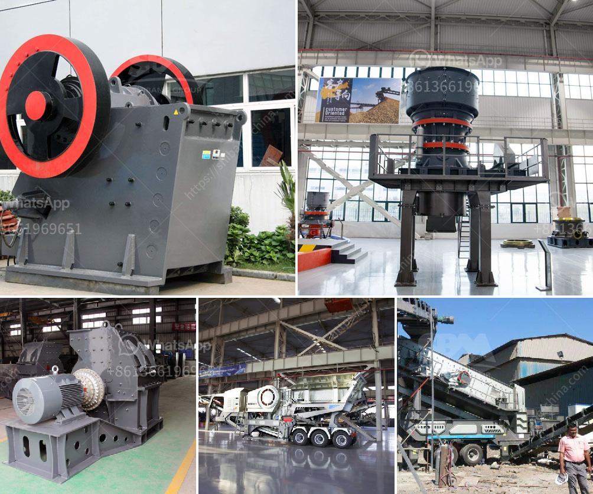

<h3>hammer mill machines in indonesia</h3>
Hammer mill machines are commonly used in the agricultural sector for livestock feed production, biomass fuel preparation, and industrial material grinding. In Indonesia, hammer mills are used to process various biomass materials such as rice husks, sawdust, and other agricultural waste into small particles which can be further processed into pellets for fuel or animal feedstock.

The utilization of hammer mill machines in Indonesia can be traced back to ancient times when agricultural waste was turned into labor-intensive products such as rope, woven mats, and even building materials. Today, hammer mills are used extensively in Indonesia to grind a wide range of industrial materials including encapsulated fishmeal, eggshells, bones, wood chips, and more.

One of the reasons why hammer mill machines are popular in Indonesia is the ability to grind a wide range of materials irrespective of their rigidity or abrasiveness. In addition, hammer mills are cheaper to buy and maintain compared to roller mills due to their simple yet effective design and operation. They are also efficient in terms of energy consumption and require less maintenance.

The working principle of a hammer mill involves the rotational motion of hammers, which impact the materials in the grinding chamber. The material is fed into the hammer mill through a gravity feed hopper and guided by a feed roller. The hammers strike the material and generate a combination of crushing, impacting, and grinding forces to reduce the size of the material. The final product is discharged through a perforated screen, controlling the particle size.

In the agricultural sector, hammer mills are mainly used for livestock feed production. Farmers in Indonesia often encounter challenges in processing various agricultural residues such as rice straw, corn stalks, and sugarcane bagasse. These residues, if left unprocessed, can pose environmental problems and waste valuable resources. However, hammer mill machines can efficiently convert these agricultural residues into small, consistent-sized particles that can be used as animal feedstock.

Hammer mills are also in high demand in the biomass fuel industry in Indonesia. The increasing awareness and demand for renewable energy sources make biomass a viable option for energy production. Biomass fuel preparation involves grinding and drying the biomass material to a specific particle size, which can be achieved using hammer mill machines. The finely ground biomass can then be compacted into pellets for combustion in boilers or furnaces, providing a sustainable and eco-friendly alternative to fossil fuels.

Moreover, hammer mills find applications in various industries, including food processing, chemical manufacturing, and pharmaceuticals. They can be used to grind food products such as grains, herbs, spices, and even coffee beans. Hammer mills are also used in the production of chemicals and pharmaceutical products, where fine grinding is required to achieve the desired particle size and consistency.

In conclusion, hammer mill machines play a vital role in various industries in Indonesia. They are widely used in livestock feed production, biomass fuel preparation, and industrial material grinding. The versatility, cost-effectiveness, and efficiency of hammer mills make them a popular choice for processing a wide range of materials in Indonesia and contribute to the sustainable use of agricultural waste and biomass resources.
<h3>Contact us</h3><ul><li><strong>Whatsapp:&nbsp;<a href="https://wa.me/8613661969651">+8613661969651</a></strong></li><li><a href="https://swt.shibang-china.com/?git&amp;zhl&amp;hammer mill machines in indonesia"><strong>Online Service(chat now)</strong></a></li></ul><h3>Related</h3><ul><li><a href='rock crusher quarry.md'>rock crusher quarry</a></li><li><a href='diamond mining equipment.md'>diamond mining equipment</a></li><li><a href='jual grinding mill hammer mill philippines.md'>jual grinding mill hammer mill philippines</a></li><li><a href='hammer mill pc800 x 600.md'>hammer mill pc800 x 600</a></li><li><a href='complete iron ore processing plant cost.md'>complete iron ore processing plant cost</a></li></ul>