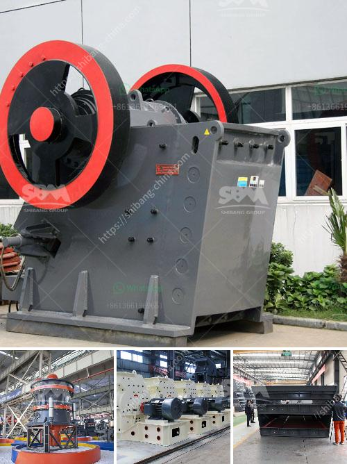

<h3>hammer mill nigeria</h3>
A hammer mill is a machine used to shred or crush materials into smaller pieces. The basic design of machines of this type involve a rotating shaft to which free-swinging hammers are attached. This assembly is enclosed by a drum which holds the material intended for shredding or crushing. Hammer mills are used widely in various industries, such as mining, road construction, agriculture, and the food industry.

In Nigeria, hammer mills are utilized in almost all the states due to their efficiency and convenience in grinding grains and agricultural materials. A typical hammer mill consists of a horizontal rotor assembly fitted inside a metal housing. The rotor assembly includes a series of hammers which strike and grind the material to be shredded.

Nigerian farmers rely heavily on hammer mills when it comes to processing their agricultural products. This machine efficiently breaks down a variety of products, such as grains, maize, beans, groundnut, soybeans, sorghum, and spices among others. In addition to various agricultural products, a hammer mill can also process wood, coal, and waste materials.

To fully utilize this machine, it is important to have a sufficient understanding of its structure and operation principles. In Nigeria, the unique requirements of each farming operation vary greatly. Farmers and processors need to determine the desired particle size for their end products and adjust the hammer mill accordingly. Hammer mills are available in various sizes and configurations to suit different processing needs.

The benefits of using a hammer mill are not limited to grain grinding. Farmers and processors can take advantage of this versatile tool to pulverize and reduce a wide range of materials. When used in conjunction with a pellet mill, a hammer mill can potentially increase the overall efficiency of the pellet-making process, producing finer particles in less time.

In conclusion, a hammer mill is an essential tool for Nigerian farmers, providing them with convenience and efficiency in their daily operations. With the ability to process various agricultural products, as well as wood and waste materials, hammer mills contribute significantly to the agricultural sector in Nigeria. Proper understanding and utilization of this machine can greatly enhance productivity and profitability for farmers and processors alike.
<h3>Contact us</h3><ul><li><strong>Whatsapp:&nbsp;<a href="https://wa.me/8613661969651">+8613661969651</a></strong></li><li><a href="https://swt.shibang-china.com/?git&amp;zhl&amp;hammer mill nigeria"><strong>Online Service(chat now)</strong></a></li></ul><h3>Related</h3><ul><li><a href='granite machine manufacturer india.md'>granite machine manufacturer india</a></li><li><a href='cost of starting a small gold mine zimbabwe.md'>cost of starting a small gold mine zimbabwe</a></li><li><a href='coal crusher design.md'>coal crusher design</a></li><li><a href='iron sand arator in philippines.md'>iron sand arator in philippines</a></li><li><a href='slag crushing plant.md'>slag crushing plant</a></li></ul>