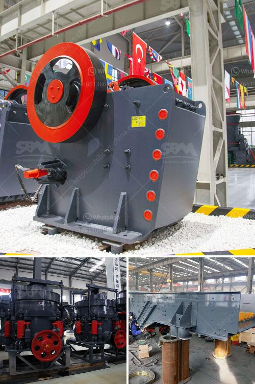

<h3>hammer mill pc800 x 600</h3>
The versatility and efficiency of the hammer mill PC800 x 600 proves its value in various applications. Whether it is used in the crushing of aggregates, minerals, woods, or even waste materials, the hammer mill PC800 x 600 delivers optimal performance and reliability.

With its robust construction and state-of-the-art features, the hammer mill PC800 x 600 is designed for tackling heavy-duty tasks. Equipped with a high-speed rotor, the machine ensures efficient and consistent crushing of large materials. The rotor hammers, made of high-quality steel, deliver a powerful impact, reducing the material into smaller particles.

The hammer mill PC800 x 600 features a large feed opening, allowing it to handle materials with a maximum size of 700mm. This ensures that even bulky materials can be easily processed. Moreover, the adjustable grid plate allows for precise control over the final product size, resulting in a more uniform and desirable output.

One of the key features of the hammer mill PC800 x 600 is its versatility. It can be used to crush a wide range of materials, including aggregates such as limestone, granite, and basalt. It is equally effective in processing minerals such as iron ore, copper, and gold, delivering consistent results. Additionally, the hammer mill PC800 x 600 can also handle wood materials, making it a valuable tool in the production of wood pellets or other wood-based products.

Another significant advantage of the hammer mill PC800 x 600 is its low energy consumption. The machine is equipped with a high-speed motor, ensuring efficient crushing with minimal power usage. This not only reduces operational costs but also contributes to a more sustainable and environmentally friendly operation.

The hammer mill PC800 x 600 is also designed with user convenience in mind. Its compact and modular design allows for easy installation and maintenance. The machine is equipped with replaceable wear parts, ensuring a longer lifespan and minimizing downtime. Its user-friendly control panel provides operators with easy access to adjust the machine according to their specific requirements.

Furthermore, the hammer mill PC800 x 600 is built to withstand demanding working conditions. Its sturdy construction and high-quality materials ensure durability and reliability, even in the harshest environments. This makes it an ideal choice for mining, construction, and industrial applications where reliability is paramount.

In conclusion, the hammer mill PC800 x 600 is a versatile and efficient machine that delivers exceptional performance in various applications. Its robust construction, optimal design features, and low energy consumption make it a valuable asset for businesses across different industries. Whether it is used in crushing aggregates, minerals, woods, or waste materials, the hammer mill PC800 x 600 is a reliable solution that guarantees consistent results and helps businesses achieve their production goals.
<h3>Contact us</h3><ul><li><strong>Whatsapp:&nbsp;<a href="https://wa.me/8613661969651">+8613661969651</a></strong></li><li><a href="https://swt.shibang-china.com/?git&amp;zhl&amp;hammer mill pc800 x 600"><strong>Online Service(chat now)</strong></a></li></ul><h3>Related</h3><ul><li><a href='crushing and grinding.md'>crushing and grinding</a></li><li><a href='how to buy brick crushing machine from bangladesh.md'>how to buy brick crushing machine from bangladesh</a></li><li><a href='kenya quartz crushing.md'>kenya quartz crushing</a></li><li><a href='buy mobile crusher.md'>buy mobile crusher</a></li><li><a href='quartz stone processing machines.md'>quartz stone processing machines</a></li></ul>