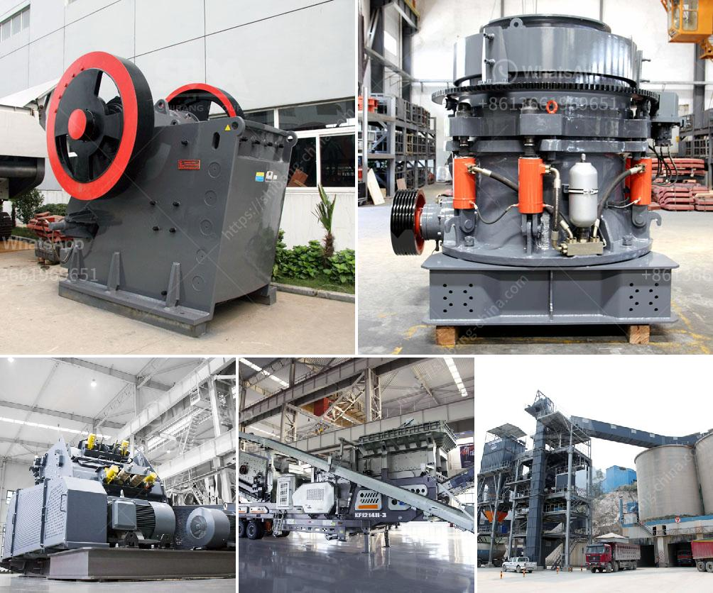

<h3>hammer mill prices in zimbabwe</h3>
Hammer mill is a relatively simple machine in a farming community. The machine is used to crush and grind grains, maize, wheat, and other crops that are fed into it. The hammer mill operates by rotating blades that crush the materials against a perforated screen. This helps to break down the materials into smaller pieces, making it easier to process or feed to animals.

In Zimbabwe, the use of hammer mills has increased dramatically in recent years. This can be attributed to the high cost of electricity and the shortage of grinding mills. Some small-scale farmers have been forced to process their grains using the hammer mill instead of grinding mills. This has resulted in an increase in demand for these machines, leading to varying prices in the market.

The prices of hammer mills in Zimbabwe are determined by several factors, including the current exchange rate, the prevailing economic conditions, and the demand for the product. Typically, a hammer mill can vary in price from $500 to $10,000, depending on the size, brand, and functionality. The more expensive models are designed for heavy-duty use and can process larger quantities of grains within a short period.

The brand of the hammer mill also plays a significant role in determining its price. Some well-known brands are more expensive than others due to their reputation for quality and durability. These brands often come with a warranty, providing peace of mind to the buyer. However, there are also affordable options available in the market that offer similar functionality and quality.

Additionally, the size of the hammer mill can affect its price. Smaller models, which are suitable for small-scale farmers or households, are generally less expensive compared to larger models used for commercial purposes. However, it is important to consider the processing capacity required to meet your needs before purchasing a smaller, more affordable model.

Aside from price, it is also important to consider the availability of spare parts and after-sales service. Opting for a brand or model that has easily accessible spare parts and reliable after-sales service can save you money in the long run. Being able to easily replace worn-out parts or receive prompt service in case of any issues can prevent costly repairs or the need for a complete replacement.

In conclusion, the prices of hammer mills in Zimbabwe can vary depending on various factors such as the size, brand, functionality, and current economic conditions. It is essential to assess your specific needs and budget before making a purchase. Considering factors such as the processing capacity required, the availability of spare parts, and after-sales service can help you make an informed decision and ensure value for your money.
<h3>Contact us</h3><ul><li><strong>Whatsapp:&nbsp;<a href="https://wa.me/8613661969651">+8613661969651</a></strong></li><li><a href="https://swt.shibang-china.com/?git&amp;zhl&amp;hammer mill prices in zimbabwe"><strong>Online Service(chat now)</strong></a></li></ul><h3>Related</h3><ul><li><a href='kokstad grinding mill for sale.md'>kokstad grinding mill for sale</a></li><li><a href='crusher cost equipment crusher malaysia.md'>crusher cost equipment crusher malaysia</a></li><li><a href='to choose jaw crusher.md'>to choose jaw crusher</a></li><li><a href='calcium carbonate milling machine.md'>calcium carbonate milling machine</a></li><li><a href='diamond screening equipment for sale.md'>diamond screening equipment for sale</a></li></ul>