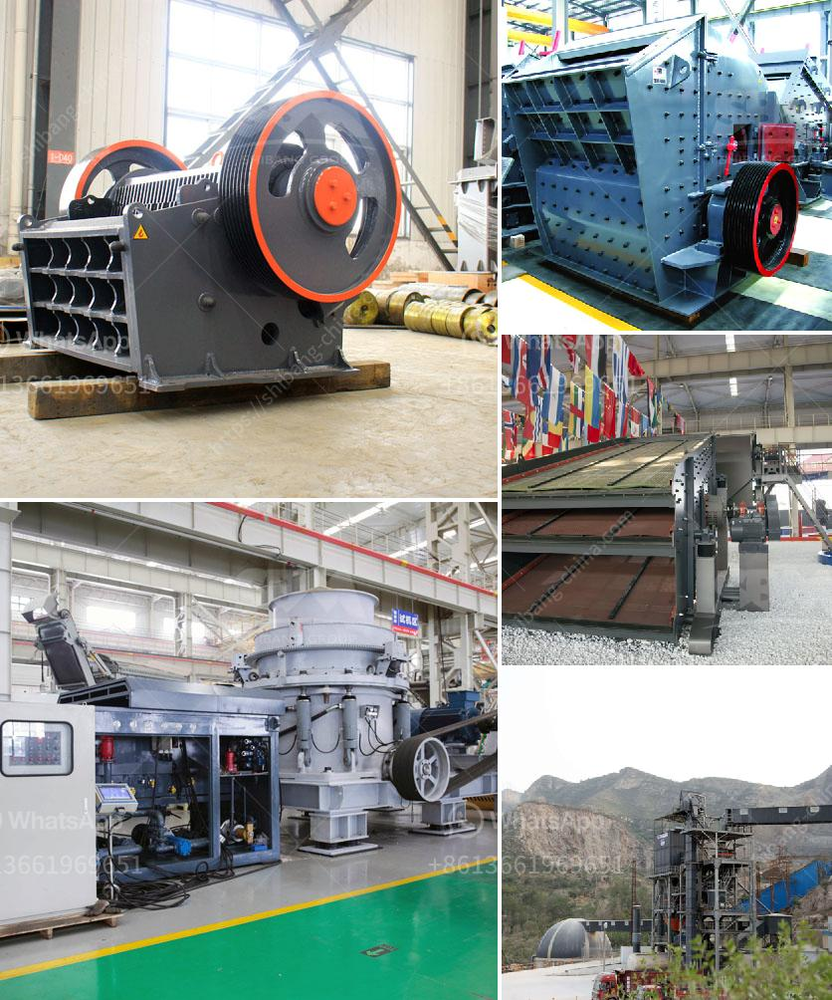

<h3>hammer mill sale in malaysia</h3>
Are you in the market for a hammer mill in Malaysia? Searching for one to add to your machinery lineup can be a daunting task. From purchasing reputable brands to ensuring the machine is suitable for your specific needs, there are numerous factors to consider. In this article, we will discuss the benefits of hammer mill sale in Malaysia and provide a guide to help you make an informed purchasing decision.

A hammer mill is a machine used to shred or crush materials into smaller pieces. The basic design of a hammer mill incorporates a central rotating shaft or drum with hammers mounted on it. When the material is fed into the rotating drum, the hammers break it down into pieces of the desired size.

One of the main benefits of using a hammer mill is its versatility. Hammer mills can process a wide range of materials, including grains, fibrous materials, and even plastics. This makes it a crucial machine in various industries, such as agriculture, mining, waste management, and recycling.

When it comes to purchasing a hammer mill in Malaysia, several factors need to be considered. Firstly, it is important to choose a reputable brand known for manufacturing high-quality machines. Look for brands that have a strong presence in the market and positive customer reviews. This will ensure that you are investing in a reliable and durable machine.

Next, assess your specific needs and requirements. Consider the type and size of materials you will be processing, the desired output size, and the expected production capacity. These factors will help you determine the appropriate size and power of the hammer mill you need. Additionally, consider the maintenance requirements and the availability of spare parts for the machine you are considering.

Another important consideration is the price of the hammer mill. While cost is a significant factor, it should not be the sole determining factor in your purchasing decision. It is important to strike a balance between price and quality. Choose a machine that offers good value for your money and has the features and capabilities you require.

The best way to find a suitable hammer mill in Malaysia is to research and compare different options. Visit websites of reputable suppliers and manufacturers, browse product catalogs, and compare specifications and prices. Take note of any additional features or technologies that may enhance the machine's performance or improve your workflow.

Additionally, don't hesitate to reach out to suppliers directly to request more information or clarify any doubts you may have. Reliable suppliers will be happy to assist you in finding a hammer mill that meets your specific requirements and budget.

In conclusion, finding the right hammer mill for sale in Malaysia requires careful consideration of various factors. By purchasing from reputable brands, assessing your specific needs, and comparing different options, you can make an informed decision. Remember to prioritize quality and value for money to ensure a successful investment in a reliable and efficient hammer mill.
<h3>Contact us</h3><ul><li><strong>Whatsapp:&nbsp;<a href="https://wa.me/8613661969651">+8613661969651</a></strong></li><li><a href="https://swt.shibang-china.com/?git&amp;zhl&amp;hammer mill sale in malaysia"><strong>Online Service(chat now)</strong></a></li></ul><h3>Related</h3><ul><li><a href='grinding ball mill machine manufacturer europe.md'>grinding ball mill machine manufacturer europe</a></li><li><a href='komatsu crawler crusher.md'>komatsu crawler crusher</a></li><li><a href='how to machine limestone.md'>how to machine limestone</a></li><li><a href='crushers for sale in uae.md'>crushers for sale in uae</a></li><li><a href='quartz plass grinder price.md'>quartz plass grinder price</a></li></ul>