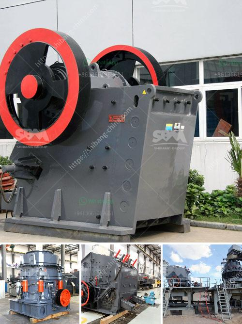

<h3>hammer mill size reduction</h3>
The hammer mill is a machine used to shred or crush materials into smaller pieces by the repeated blows of hammers. It is highly versatile and efficient in performing size reduction tasks, making it a preferred choice for many industrial processing facilities.

One of the key advantages of the hammer mill is its ability to rapidly break down a wide variety of materials, including minerals, grains, and chemicals. From medium to hard materials, it can be used to reduce their size or change their shape, giving them new functionalities. This makes the hammer mill indispensable in many industries, such as pharmaceuticals, food processing, biomass, and chemical engineering.

The working principle of a hammer mill is relatively simple - a rotating shaft equipped with several hammers revolves at high speed inside a cylindrical housing. The hammers strike the material and break it down into smaller particles. As the particles exit the mill, they are separated by size using screens or magnets, resulting in a consistent particle size distribution.

Size reduction in a hammer mill is primarily achieved through impact and attrition. In simple terms, the high-speed rotating hammers within the mill chamber collide with the incoming material, causing it to fracture into smaller pieces. This impact force creates a rapid comminution process that reduces the size of the particles being processed. At the same time, attrition occurs as the particles rub against each other or against the internal surfaces of the mill, further reducing their size.

The size of the final product is determined by the size of the screen or the gap between the hammers and the internal walls of the mill. When selecting a screen, consider the desired particle size range and the characteristics of the material being processed. Smaller screen openings will result in finer particles, while wider openings will produce larger particles.

The hammer mill is highly efficient, as it performs the entire size reduction process in one machine. The feed material is continuously fed into the mill chamber, where it is pulverized by a combination of high-speed hammers and screens. This avoids the need for multiple machines and reduces the processing time and cost.

Another advantage of the hammer mill is its versatility. It can be easily adjusted to handle different materials and particle sizes. This flexibility allows for efficient milling of various products, from hard materials like rock and metal to softer materials like grains and herbs. The hammer mill can also be equipped with different sizes of screens to produce different particle sizes, enabling further customization for specific applications.

In conclusion, the hammer mill is a versatile and efficient size reduction machine that provides excellent performance in various industries. Its ability to rapidly break down materials into smaller particles makes it ideal for processing a wide range of materials. Moreover, its simplicity of operation, cost-effectiveness, and flexibility make it a preferred choice for many industrial processing facilities. Whether you need to reduce the size of minerals, grains, or chemicals, the hammer mill is a reliable and efficient solution that can meet your diverse processing needs.
<h3>Contact us</h3><ul><li><strong>Whatsapp:&nbsp;<a href="https://wa.me/8613661969651">+8613661969651</a></strong></li><li><a href="https://swt.shibang-china.com/?git&amp;zhl&amp;hammer mill size reduction"><strong>Online Service(chat now)</strong></a></li></ul><h3>Related</h3><ul><li><a href='crawler type mobile crusher.md'>crawler type mobile crusher</a></li><li><a href='hpc cone crusher.md'>hpc cone crusher</a></li><li><a href='cde sand wash plant for sale.md'>cde sand wash plant for sale</a></li><li><a href='chromite beneficiation plant in malaysia.md'>chromite beneficiation plant in malaysia</a></li><li><a href='sand washing machines turkey.md'>sand washing machines turkey</a></li></ul>