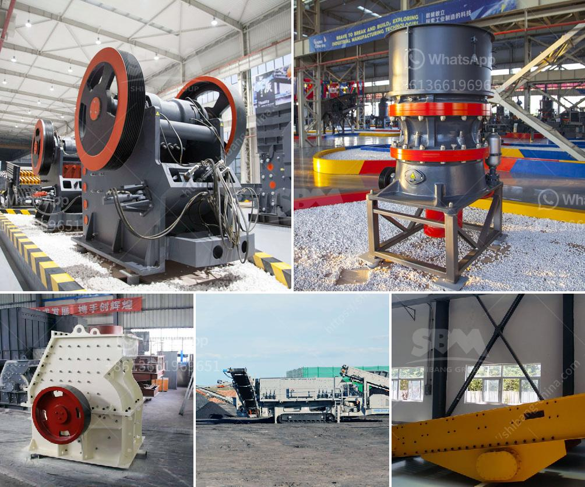

<h3>hammer mills for granite</h3>
When it comes to tasks involving grinding and crushing, one of the toughest rocks on Earth is, without a doubt, granite. Renowned for its durability and strength, granite is a popular choice for various construction projects and decorative applications. However, transforming this mighty stone into smaller, more manageable sizes requires the right machinery. This is where hammer mills come into play.

Hammer mills are high-speed machines that utilize hammers and anvils to pulverize tough materials like granite. These powerful devices are incredibly efficient, thanks to their unique design and advanced technology. By utilizing a series of rotating hammers attached to a central shaft, hammer mills can swiftly reduce large granite chunks into smaller, more uniform pieces.

The primary function of a hammer mill is to break down the material into smaller pieces. This is achieved through repeated high-speed impacts between the hammers and the granite fragments. The force applied during these collisions crushes the granite, turning the solid blocks into granular materials of various sizes. The milled granite can then be used for a wide range of applications, from paving and construction to landscaping and decorative purposes.

One distinct advantage of hammer mills is their versatility. Thanks to their modular design, these machines can be easily adjusted to produce different particle sizes. By changing the size and arrangement of the hammers, operators can control the final product's granularity. This adaptability also makes hammer mills suitable for processing different types of granite, from small pebbles to large boulders.

Another feature that sets hammer mills apart is their ability to process wet materials. Unlike other crushers, such as jaw crushers or cone crushers, hammer mills can handle moist and sticky granite without clogging the machine. This makes them ideal for crushing moist granite straight from the quarry, as there is no need for drying the material beforehand.

In addition to their robustness and flexibility, hammer mills are known for their efficiency. The innovative design and high rotational speed of the hammers guarantee a rapid reduction of the granite's size. This means that a significant amount of granite can be processed in a shorter period of time compared to other crushing methods. Consequently, the operational costs are reduced, and the overall productivity of the project is enhanced.

Furthermore, hammer mills are relatively easy to operate and maintain. With fewer components than many other crushing machines, these mills require less maintenance and troubleshooting. In case of any damage, the hammers can be easily replaced, resulting in minimal downtime and increased productivity.

When it comes to grinding granite, hammer mills are the perfect tools for the job. Their high-speed impact and crushing capabilities allow for efficient and precise reduction of the tough rock. Moreover, their versatility and ability to handle wet materials make them a go-to choice for granite processing operations. With their efficiency, ease of use, and low maintenance requirements, hammer mills are essential machines for any granite grinding project.
<h3>Contact us</h3><ul><li><strong>Whatsapp:&nbsp;<a href="https://wa.me/8613661969651">+8613661969651</a></strong></li><li><a href="https://swt.shibang-china.com/?git&amp;zhl&amp;hammer mills for granite"><strong>Online Service(chat now)</strong></a></li></ul><h3>Related</h3><ul><li><a href='hammer mills for granite.md'>hammer mills for granite</a></li><li><a href='companies selling mining equipment.md'>companies selling mining equipment</a></li><li><a href='industrial pulverizing ball mill.md'>industrial pulverizing ball mill</a></li><li><a href='mining and machine in turkey.md'>mining and machine in turkey</a></li><li><a href='small mobile crushers.md'>small mobile crushers</a></li></ul>