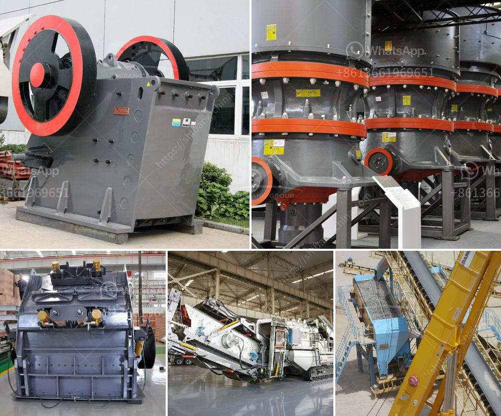

<h3>hammer mills price</h3>
Hammer mills are versatile machines used to shred or crush materials into smaller pieces. The key feature of a hammer mill is its ability to break material apart into smaller pieces through the use of hammers attached to a rotating shaft. With the proper screen size, these machines can be used in a wide range of industries to pulverize various materials.

When it comes to purchasing a hammer mill, the price is usually one of the determining factors for buyers. However, it's essential to understand that the cost of a hammer mill is influenced by various factors, and it's important to consider these factors when comparing prices.

The first factor that affects the price of a hammer mill is its size and capacity. Smaller hammer mills designed for residential or small-scale use may have lower prices compared to larger models that are suitable for industrial applications. The capacity of the machine, measured in pounds per hour or tons per hour, directly affects its price. Generally, the higher the capacity, the higher the cost.

The type of hammer mill you choose also plays a role in determining the price. There are several types of hammer mills, including gravity discharge hammer mills, full-circle hammer mills, and pneumatic discharge hammer mills. Each type has different characteristics and performance capabilities, which can affect its price. For example, full-circle hammer mills tend to be more expensive due to their higher efficiency and ability to handle a wider range of materials.

In addition to size and type, the quality of construction materials and manufacturing standards used in the hammer mill's production can also impact the price. High-quality materials like hardened steel and durable components may increase the machine's cost initially but can lead to a longer lifespan and reduced maintenance costs in the long run. On the other hand, cheaper materials may result in a lower initial cost but may also lead to more frequent repairs and replacements, increasing the overall cost over time.

Furthermore, the brand and reputation of the manufacturer can influence the price of a hammer mill. Reputable manufacturers often invest in research and development to improve the performance and durability of their machines, resulting in higher prices. However, these higher prices can be justified by the quality and reliability of the product.

Lastly, additional features and optional add-ons can also affect the price of a hammer mill. Some manufacturers offer customizable options such as different screen sizes, various power options, and automated control systems. These additional features can increase the functionality and convenience of the machine, but they also come at an extra cost.

In conclusion, the price of a hammer mill is determined by several factors, including its size, capacity, type, construction materials, manufacturing standards, manufacturer reputation, and additional features. It's crucial to assess the specific needs of your application, the quality of the machine, and the reputation of the manufacturer when considering the cost. Making an informed decision based on these factors will ensure that you invest in a hammer mill that meets your requirements and offers the best value for your money.
<h3>Contact us</h3><ul><li><strong>Whatsapp:&nbsp;<a href="https://wa.me/8613661969651">+8613661969651</a></strong></li><li><a href="https://swt.shibang-china.com/?git&amp;zhl&amp;hammer mills price"><strong>Online Service(chat now)</strong></a></li></ul><h3>Related</h3><ul><li><a href='rock crushers ball mill.md'>rock crushers ball mill</a></li><li><a href='how to start a stone crusher business.md'>how to start a stone crusher business</a></li><li><a href='format of the business plan for stone crusher.md'>format of the business plan for stone crusher</a></li><li><a href='price of artificial sand mill.md'>price of artificial sand mill</a></li><li><a href='tracked jaw crusher for sale.md'>tracked jaw crusher for sale</a></li></ul>