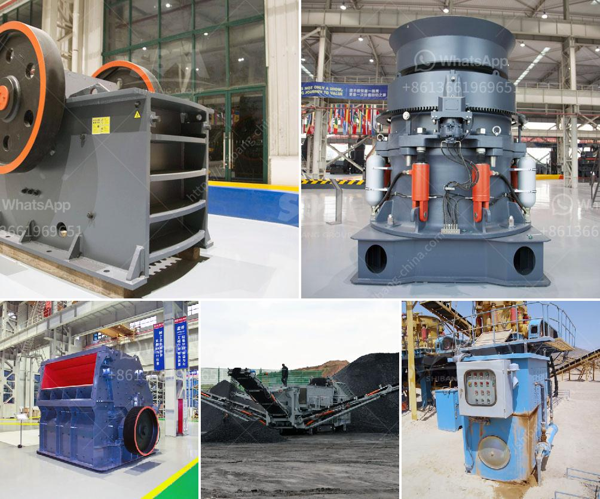

<h3>hard rock quarry cursher in libya</h3>
Hard rock quarry crushers are one of the most important pieces of equipment in any quarry operation. They are responsible for breaking down large rocks into smaller, more manageable sizes for further processing. With the rise in demand for construction materials in Libya, the need for hard rock quarry crushers is increasing rapidly.

Libya, situated in North Africa, is a country rich in natural resources, including oil, gas, and minerals. The mining industry plays a significant role in the country's economy, and the demand for construction materials, such as aggregates, is on the rise. Hard rock quarry crushers are essential for the production of these materials.

In a typical quarry operation, rock blasting is followed by crushing to produce aggregates for construction purposes. The process involves several stages, starting with the primary crusher that breaks down the rocks to a manageable size. Secondary and tertiary crushers further refine the material into the desired sizes.

One of the key advantages of hard rock quarry crushers in Libya is their ability to handle a wide range of materials. Whether it is granite, limestone, or basalt, these crushers can efficiently process them all. This versatility allows quarry operators to produce various types of aggregates for different construction applications.

To ensure the efficiency and productivity of the crushers, regular maintenance is crucial. Proper lubrication, inspection, and timely replacement of worn-out parts are essential. Quarry operators in Libya understand the importance of investing in high-quality crushers and maintaining them to maximize their lifespan.

Additionally, safety is a top priority in any quarry operation. Hard rock quarry crushers are designed with multiple safety features to protect workers and minimize accidents. These features include emergency stop buttons, protective housing, and safety guards.

In conclusion, hard rock quarry crushers are indispensable equipment in the mining industry in Libya. They play a crucial role in the production of aggregates for construction purposes. With proper maintenance and adherence to safety guidelines, they can provide years of efficient and reliable operation.
<h3>Contact us</h3><ul><li><strong>Whatsapp:&nbsp;<a href="https://wa.me/8613661969651">+8613661969651</a></strong></li><li><a href="https://swt.shibang-china.com/?git&amp;zhl&amp;hard rock quarry cursher in libya"><strong>Online Service(chat now)</strong></a></li></ul><h3>Related</h3><ul><li><a href='used rock crusher dealers in usa.md'>used rock crusher dealers in usa</a></li><li><a href='forno paragon para venda.md'>forno paragon para venda</a></li><li><a href='crushing plant in maule.md'>crushing plant in maule</a></li><li><a href='crushing plant price list.md'>crushing plant price list</a></li><li><a href='ball mill cement grinding.md'>ball mill cement grinding</a></li></ul>