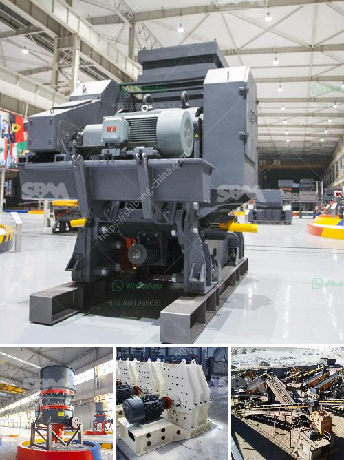

<h3>harga impact crusher</h3>
Impact crushers play a key role in the mining and construction industry as they can crush a wide range of materials with ease. Harga impact crusher, also known as a secondary impact crusher, provides excellent reduction ratios for a variety of materials. Harga impact crushers are built on advanced technology with a combination of domestic applications. More human-oriented with simple design and reasonable structure, bigger and better cavity, higher capacity. Harga impact crusher becomes the most popular mobile crusher in the world.

Harga impact crusher boasts cubic shape end products and efficient reduction ratios, making it a good concrete crusher as well as limestone, asphalt, and other hard and brittle materials. Throughout its over 30-year history, Harga impact crusher has been renowned for its durability, reliability, and versatility. This series of crushers effortlessly crushes materials up to 350 MPa, allowing them to be used in stationary as well as mobile applications.

The working principle of the harga impact crusher is crushing by impact energy produced in the cavity. When a material enters the rotor, it is crushed by the high-speed impact of the blow bar. The final crushed particles are discharged through the discharge opening at the bottom. The rotor speed, feeding size, and material density determine the throughput capacity of the machine. The higher the rotor speed or the smaller the feeding size, the higher the throughput capacity.

Harga impact crushers are available in stationary, track, and mobile designs. Another industry usage is slag, specifically blast furnace slag, which is less abrasive than steel furnace slag and can be broken down if processed through an impact crusher. Harga impact crushers are ideal for primary and secondary crushing in quarrying applications, recycling, infrastructure, and construction. Harga impact crushers are renowned for high reduction ratios and comply with strict product grain shape requirements.

To meet different crushing applications and requirements, harga impact crushers are available in several models with capacities ranging from 80 to 350 tph. Thanks to their compact design, harga impact crushers can be easily transported to different worksites and fitted into any crushing process, making them perfect for both mobile and stationary applications. In addition, their simple design and low operational costs make them a popular choice for contractors and quarry operators. 

In conclusion, harga impact crushers are suitable for a wide range of applications and industries. Their robust construction and high-performance make them an indispensable asset in the mining and construction industry. Whether it is limestone, concrete, or other hard and brittle materials, harga impact crushers provide efficient reduction ratios and excellent end product quality. With their versatility and reliability, harga impact crushers enable contractors to meet their project requirements with ease.
<h3>Contact us</h3><ul><li><strong>Whatsapp:&nbsp;<a href="https://wa.me/8613661969651">+8613661969651</a></strong></li><li><a href="https://swt.shibang-china.com/?git&amp;zhl&amp;harga impact crusher"><strong>Online Service(chat now)</strong></a></li></ul><h3>Related</h3><ul><li><a href='different type of grinding mills.md'>different type of grinding mills</a></li><li><a href='vertical mill calcium.md'>vertical mill calcium</a></li><li><a href='gold milling machine for sale in south africa.md'>gold milling machine for sale in south africa</a></li><li><a href='stone crushing machine suppliers.md'>stone +crushing +machine +suppliers</a></li><li><a href='feldspar vsi crusher.md'>feldspar vsi crusher</a></li></ul>