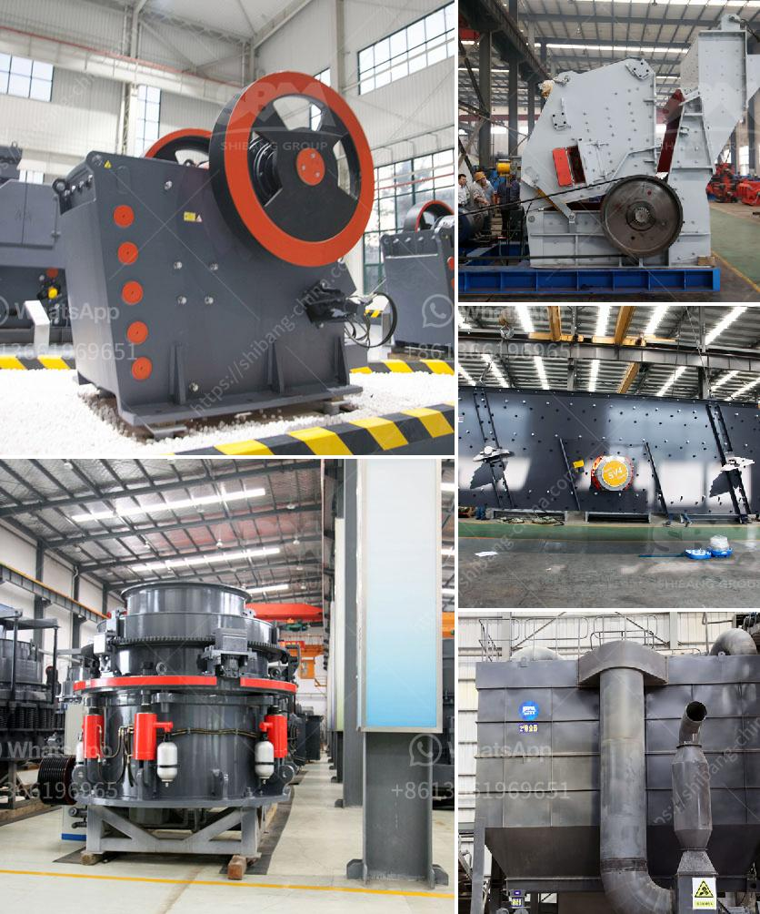

<h3>harga mobile crusher 100tph</h3>
In the modern world, technology is constantly evolving, and so is the construction industry. There is a growing demand for stone aggregates and manufactured sand, as they are the basic raw materials used in various construction projects such as buildings, roads, bridges, and railways. One of the essential equipment in stone crushing is the mobile crusher, which immensely helps in breaking down large rocks and stones into smaller pieces.

When it comes to mobile crushers, the market is flooded with numerous options. However, one model that stands out is the harga mobile crusher 100tph. It is a versatile and highly efficient machine that is built to handle a wide range of applications. From limestone to granite, from gravel to demolition waste, this mobile crusher can tackle any material with ease.

With its compact design and powerful engine, the harga mobile crusher 100tph is easy to transport and can be set up quickly at any construction site. This saves valuable time and money, as there is no need for additional transportation or setup costs. Moreover, its mobility allows the crusher to move from one location to another, ensuring flexibility in crushing operations.

Equipped with advanced features, the harga mobile crusher 100tph offers an optimal crushing experience. Its sturdy construction and robust components ensure durability and longevity, even in the harshest conditions. The powerful jaw crusher can handle large rocks, while the efficient cone crusher produces high-quality aggregates. The integrated vibrating screen separates the crushed materials into different sizes, ensuring uniformity and precise grading.

Safety is also a top priority for the harga mobile crusher 100tph. It is equipped with various safety features to protect operators and maintenance personnel. The machine is designed with automatic overload protection, which prevents damage to the crusher in case of excessive load or foreign objects. Additionally, the remote control allows operators to control the crusher from a safe distance, reducing the risk of accidents.

Apart from its efficiency and safety, the harga mobile crusher 100tph is also environmentally friendly. It is designed to minimize dust emissions, ensuring a cleaner working environment. The low noise levels reduce noise pollution, making it suitable for urban areas and noise-sensitive projects. In addition, the mobile crusher consumes less fuel, reducing carbon emissions and contributing to a greener future.

In conclusion, the harga mobile crusher 100tph is an excellent choice for stone crushing in construction projects. Its versatility, efficiency, and safety make it a valuable asset in any crushing operation. With its compact design, it ensures quick setup and easy transport, saving time and resources. Moreover, its advanced features and environmental friendliness make it a responsible choice for sustainable construction practices. When it comes to stone crushing, the harga mobile crusher 100tph is a reliable and efficient solution.
<h3>Contact us</h3><ul><li><strong>Whatsapp:&nbsp;<a href="https://wa.me/8613661969651">+8613661969651</a></strong></li><li><a href="https://swt.shibang-china.com/?git&amp;zhl&amp;harga mobile crusher 100tph"><strong>Online Service(chat now)</strong></a></li></ul><h3>Related</h3><ul><li><a href='hammer mills price.md'>hammer mills price</a></li><li><a href='ultra white silica processing.md'>ultra white silica processing</a></li><li><a href='grinding mill machine in greece.md'>grinding mill machine in greece</a></li><li><a href='ball mill in mumbai.md'>ball mill in mumbai</a></li><li><a href='small portable rock crushers.md'>small portable rock crushers</a></li></ul>