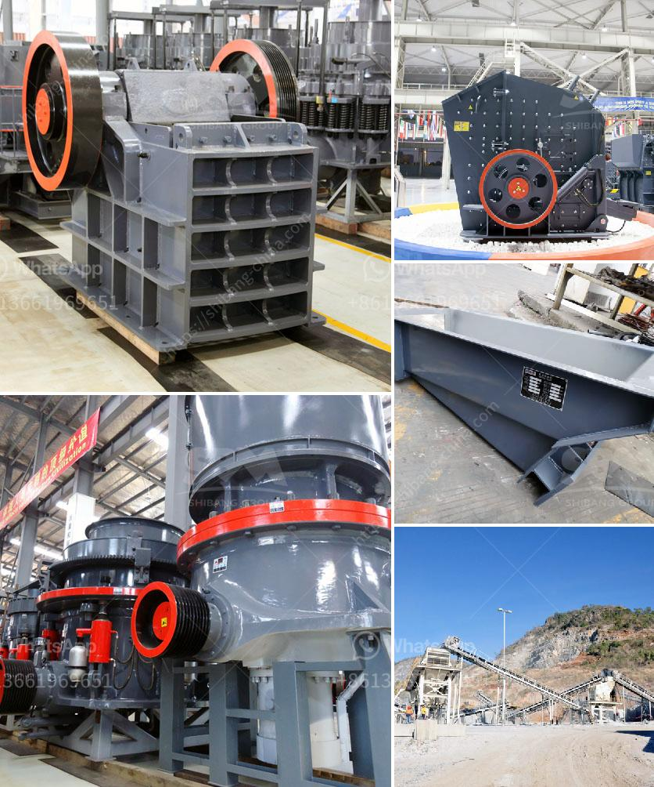

<h3>harga stone crusher 250 ton</h3>
The price of 250 tons per hour crusher is the most concerned issue for customers when purchasing stone crushing equipment. There are many factors influencing the price of stone crushing equipment such as the quality of equipment, market demand, manufacturer competition and even the fluctuation of steel prices. The price of the stone crusher is often determined by the manufacturer. For example, Shanghai Zenith is a well-known brand in China and also an influential enterprise in the industry. It has an advantage in the price of 250 tons per hour stone crushing production line, which is relatively low and attracts more customers.

Producing 250 tons of stone crusher per hour, the price is about 3 million yuan (compared with other manufacturers' investment in equipment, high-quality price is lower), because the manufacturer is a direct sales company, the realization of on-site installation of equipment, saving intermediate links, so the equipment quotation is less.

Regarding the specific price, the current manufacturer FTM Machinery has a more reliable and professional quotation method, and has taken into account the practitioner requirements for equipment status maintenance. The quotation of the equipment is mainly about 250,000-1 million small stone crusher price. Different types of machines will be different. We can guarantee that we configure a complete stone production line for users according to the user's requirements. The broken stone produced by the equipment with a grain size of less than 10 mm will be discharged into the sand washing machine, and other specifications of stone will be sent to the round vibrating screen for screening, and the finished product will be conveyed to different finished product piles.

1. Two-stage crushing plant with primary and secondary crushing, or as three-stage crushing plant with tertiary crushing.

4. Configuration of stone crusher plant according to rock characters, the normal configuration of stone crusher plant is as below:

1. Medium and Soft rock and stone: GZD series vibrating feeder + PE series jaw crusher + PF Impact crusher + YK series circular vibrating screen + several belt conveyor.

2. Medium and hard rock and stone: GZD series vibrating feeder + PE series jaw crusher + HPT cone crusher + vibrating screen + several belt conveyor.

The stone crusher plant is used for producing sand, rock and stone for construction, highway, railway and other applications. Fote Heavy Machinery, with 40 years of experience in the stone crushing production line, is skilled in the production line process design and has a high-cost performance.

With the efficient and fast development of infrastructure construction, stone crusher equipment as the most favored equipment for stone crushing industry efficiently achieves the harmony between green energy and intelligent technology. The demand is expected to reach 250 tons per hour in the next few years. There are increasing market demands for stone crushing plants, such as ballast, sand, stone chips, gravel, and concrete aggregate. The development of the quarrying industry requires stone crushing equipment to meet the corresponding market demand. Zenith research and development recommendation, has had a good influence on the economic benefits of users, and has been favorably received by users. No matter it is in the process of equipment configuration, general configuration or environmental protection, energy conservation has been considered in place, and it is very popular among the majority of users.
<h3>Contact us</h3><ul><li><strong>Whatsapp:&nbsp;<a href="https://wa.me/8613661969651">+8613661969651</a></strong></li><li><a href="https://swt.shibang-china.com/?git&amp;zhl&amp;harga stone crusher 250 ton"><strong>Online Service(chat now)</strong></a></li></ul><h3>Related</h3><ul><li><a href='cement plant price in pakistan.md'>cement plant price in pakistan</a></li><li><a href='slag roller mill.md'>slag roller mill</a></li><li><a href='stone crusher conveyor belts.md'>stone crusher conveyor belts</a></li><li><a href='ballast crusher sale kenya.md'>ballast crusher sale kenya</a></li><li><a href='marble crushing plants.md'>marble crushing plants</a></li></ul>