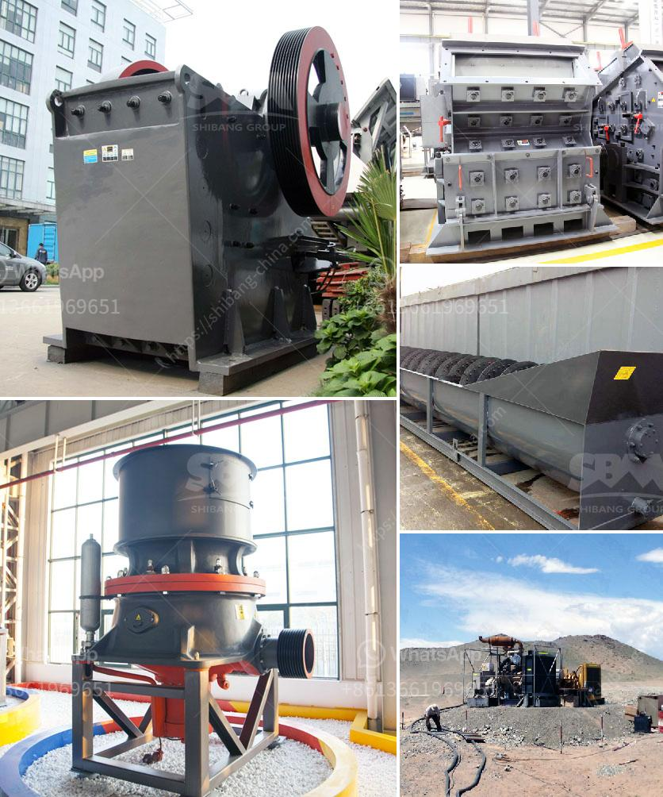

<h3>harga stone crusher plant ton</h3>
As the demand for stone materials continues to rise, so does the need for efficient and cost-effective crushing machinery. Unfortunately, many players in the industry have been struggling to keep up with the growing demand due to high production costs. However, with the advent of advanced stone crusher plants, such as the harga stone crusher plant ton, crushing materials has become more affordable and efficient than ever before.

The harga stone crusher plant ton is specifically designed to meet the unique needs of small to medium-size crushing operations in the mining and construction industries. With its compact design, ease of operation, and user-friendly features, the plant ensures impressive performance in terms of crushing capacity, versatility, and reliability. Whether it's limestone, granite, or any other stone material, the plant can handle it with ease.

But what sets the harga stone crusher plant ton apart from its competitors? Firstly, the plant boasts a robust construction that ensures durability and long lifespan, even in the harshest working conditions. Its powerful crushing capacity enables it to process a wide range of materials quickly and efficiently, thus maximizing productivity. Additionally, its adjustable settings allow users to obtain precisely sized output materials, making it suitable for various applications.

Furthermore, the plant is equipped with advanced safety features to protect operators and prevent costly downtime. The user-friendly control panel allows operators to easily monitor and adjust the crushing process, ensuring optimal performance at all times. Maintenance is also made hassle-free with convenient access to components, reducing downtime and increasing operational efficiency.

The competitive pricing of the harga stone crusher plant ton makes it an ideal choice for businesses of all sizes. The plant's efficient performance, combined with its affordable price, allows businesses to increase their productivity and profitability without breaking the bank. It is a smart investment that delivers a high return on investment, ensuring a competitive edge in the industry.

In conclusion, the harga stone crusher plant ton is a game-changer in the crushing industry. Its compact design, high crushing capacity, and competitive pricing make it an excellent choice for any business looking to enhance productivity and efficiency. With this plant, businesses can fulfill the growing demand for stone materials while staying ahead of the competition.
<h3>Contact us</h3><ul><li><strong>Whatsapp:&nbsp;<a href="https://wa.me/8613661969651">+8613661969651</a></strong></li><li><a href="https://swt.shibang-china.com/?git&amp;zhl&amp;harga stone crusher plant ton"><strong>Online Service(chat now)</strong></a></li></ul><h3>Related</h3><ul><li><a href='crusher machine for sale in nepal.md'>crusher machine for sale in nepal</a></li><li><a href='limestone plant manufacturer in turkey.md'>limestone plant manufacturer in turkey</a></li><li><a href='philippines cone crusher.md'>philippines cone crusher</a></li><li><a href='how to made talcum powder.md'>how to made talcum powder</a></li><li><a href='coal wash and crusher machine.md'>coal wash and crusher machine</a></li></ul>