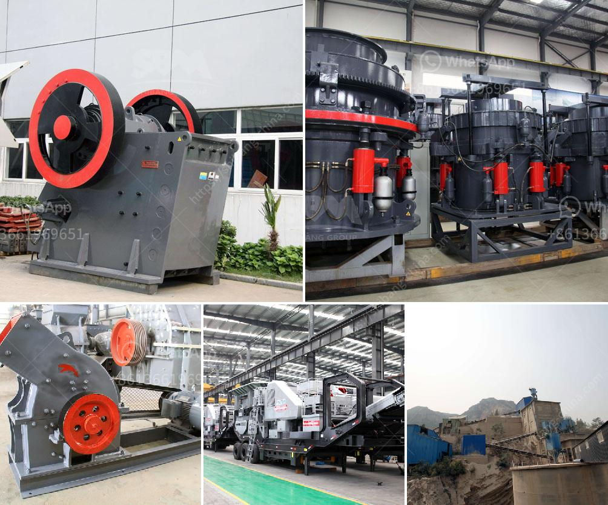

<h3>high energy ball mill</h3>
High energy ball milling is a type of mechanical grinding method that is used to prepare nanomaterials rapidly and efficiently. This technique has been widely applied in various fields, such as mineral, metallurgy, chemical industry, and materials science. It is a simple and effective method, with numerous advantages including short reaction time, high yield, and easy scale-up.

The principle of high energy ball milling is to transfer the mechanical energy provided by the milling device to the powder particles. This energy is used to induce various mechanical effects, such as fracture, deformation, and dispersion. The collisions between the balls and the powder particles generate high-level impacts, resulting in the formation of crystal defects, grain refinement, and even alloying.

The milling device used in high energy ball milling is called a "ball mill". It consists of a container filled with balls or pebbles made of steel or other materials. The material to be milled is placed inside the container together with a milling medium (usually balls), and the container is rotated at high speeds. As a result, the balls cascade and collide with the powder particles, enabling effective grinding and mixing.

One significant advantage of high energy ball milling is its ability to produce a wide range of materials with unique properties. By adjusting the milling parameters such as ball size, ball-to-powder ratio, and milling speed, it is possible to tailor the microstructure and properties of the resulting materials. For example, high energy ball milling can be used to create nanocrystalline materials with enhanced mechanical properties, such as high strength and hardness.

In addition, high energy ball milling can also be used for the synthesis of new materials. This includes the production of alloys, composites, and compounds that cannot be obtained by conventional methods. The high energy input during milling provides sufficient thermal and mechanical energy to overcome thermodynamic barriers, resulting in the formation of new phases and structures.

Furthermore, high energy ball milling is a versatile technique that allows the incorporation of various additives and modifiers. For example, surfactants can be used to control the particle size and surface properties of the milled powders. This is particularly useful when preparing nanomaterials for specific applications, such as catalysts or electronic devices.

Despite its numerous advantages, high energy ball milling also has some limitations. One major drawback is the generation of heat during the milling process. The high energy input can cause temperature rise in the milling container, which may lead to thermally-induced phase transformations or degradation of the milled powders. Therefore, it is crucial to carefully control the milling conditions to avoid overheating and ensure the desired product quality.

In summary, high energy ball milling is a powerful technique for the synthesis and modification of various materials. Its ability to provide intensive mechanical impacts and generate unique microstructures makes it a valuable tool in materials science and engineering. With further advancements in milling technology and understanding of the underlying mechanisms, high energy ball milling is expected to play a significant role in the development of advanced materials with tailored properties.
<h3>Contact us</h3><ul><li><strong>Whatsapp:&nbsp;<a href="https://wa.me/8613661969651">+8613661969651</a></strong></li><li><a href="https://swt.shibang-china.com/?git&amp;zhl&amp;high energy ball mill"><strong>Online Service(chat now)</strong></a></li></ul><h3>Related</h3><ul><li><a href='balls mill for limestone.md'>balls mill for limestone</a></li><li><a href='components cone crusher and hydraulic system.md'>components cone crusher and hydraulic system</a></li><li><a href='stone crusher plant management software.md'>stone crusher plant management software</a></li><li><a href='scrap prices per ton in south africa.md'>scrap prices per ton in south africa</a></li><li><a href='crusher plant in sargodha.md'>crusher plant in sargodha</a></li></ul>