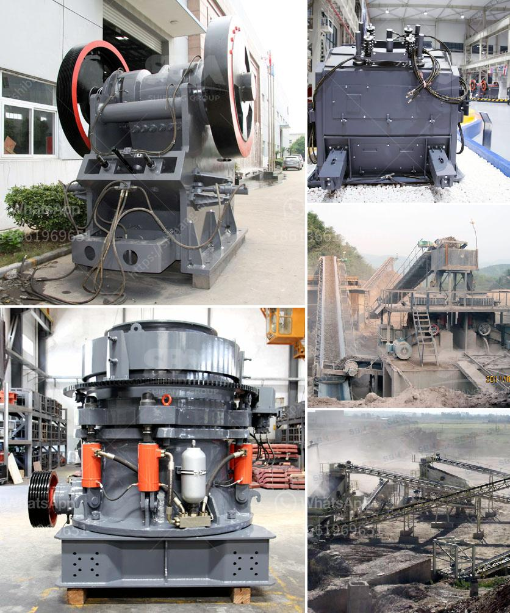

<h3>horizontal impact crusher for sale</h3>
Horizontal impact crushers are versatile pieces of equipment that can operate in a variety of environments. From the crushing of limestone to the recycling of concrete, these machines can handle it all. When it comes to finding the right horizontal impact crusher for sale, there are several factors to consider.

Firstly, it is important to understand the application and the desired output. Horizontal impact crushers are designed to reduce large rocks into smaller pieces. They are often used for the primary crushing of materials such as limestone, granite, and concrete. The size of the output can vary depending on the crusher model, but most horizontal impact crushers produce a cubic shape output.

Another important factor to consider when looking for a horizontal impact crusher for sale is the feed opening size. This determines the maximum size of the material that can be fed into the crusher. It is important to choose a crusher with a feed opening size that can accommodate the size of the material being processed.

The rotor is another critical component of a horizontal impact crusher. It is the part of the crusher that delivers the crushing force to the material. The rotor is typically made of high-quality steel and is equipped with blow bars or hammers. The number of blow bars or hammers can vary depending on the crusher model. It is important to choose a crusher with a well-designed rotor that can deliver the desired crushing force.

The adjustable settings of a horizontal impact crusher are also important to consider. These settings allow the operator to control the size of the output and the desired product shape. The adjustable settings can be easily changed to meet specific requirements. Some crushers even have hydraulic settings, which make adjustment even easier.

When looking for a horizontal impact crusher for sale, it is also important to consider the overall maintenance and operating costs. Some models may require more frequent maintenance or have higher operating costs compared to others. It is important to choose a crusher that is not only reliable but also cost-effective in the long run.

In conclusion, a horizontal impact crusher is a versatile and efficient piece of equipment that can handle a wide range of materials and applications. When looking for a crusher for sale, it is important to consider factors such as the application, desired output, feed opening size, rotor design, adjustable settings, and overall maintenance and operating costs. By carefully considering these factors, one can find the right horizontal impact crusher for their specific needs.
<h3>Contact us</h3><ul><li><strong>Whatsapp:&nbsp;<a href="https://wa.me/8613661969651">+8613661969651</a></strong></li><li><a href="https://swt.shibang-china.com/?git&amp;zhl&amp;horizontal impact crusher for sale"><strong>Online Service(chat now)</strong></a></li></ul><h3>Related</h3><ul><li><a href='mobile crusher japan.md'>mobile crusher japan</a></li><li><a href='how much is a ball mill.md'>how much is a ball mill</a></li><li><a href='equipment cost for silica sand mining.md'>equipment cost for silica sand mining</a></li><li><a href='bauxite processing plant.md'>bauxite processing plant</a></li><li><a href='sell jaw crusher jaw pe 250x400 tph.md'>sell jaw crusher jaw pe 250x400 tph</a></li></ul>